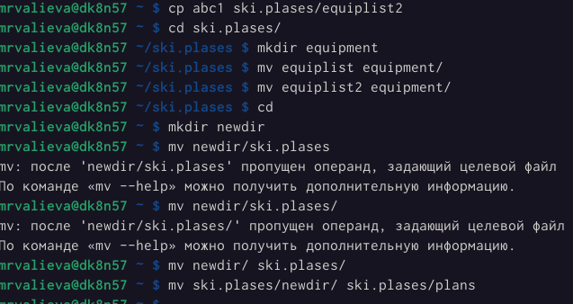
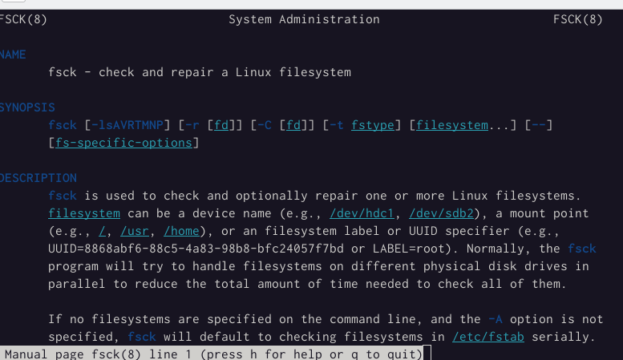

---
## Front matter
lang: ru-RU
title: Презентация по лабораторной работе №5
subtitle: Анализ файловой системы Linux. Команды для работы с файлами и каталогами
author:
  - Валиева Марина Русланбековна
institute:
  - Российский университет дружбы народов, Москва, Россия

## i18n babel
babel-lang: russian
babel-otherlangs: english

## Formatting pdf
toc: false
toc-title: Содержание
slide_level: 2
aspectratio: 169
section-titles: true
theme: metropolis
header-includes:
 - \metroset{progressbar=frametitle,sectionpage=progressbar,numbering=fraction}
 - '\makeatletter'
 - '\beamer@ignorenonframefalse'
 - '\makeatother'
---

# Информация

## Докладчик

:::::::::::::: {.columns align=center}
::: {.column width="70%"}

  * Валиева Марина Русланбековна
  * Российский университет дружбы народов

:::
::: {.column width="30%"}


# Вводная часть


## Цели и задачи

Ознакомление с файловой системой Linux, её структурой, именами и содержанием каталогов. Приобретение практических навыков по применению команд для работы с файлами и каталогами, по управлению процессами (и работами), по проверке использования диска и обслуживанию файловой системы.


## Материалы и методы

- Процессор `pandoc` для входного формата Markdown
- Результирующие форматы
	- `pdf`
	- `html`
- Автоматизация процесса создания: `Makefile`

# Создание презентации

## Процессор `pandoc`

- Pandoc: преобразователь текстовых файлов
- Сайт: <https://pandoc.org/>
- Репозиторий: <https://github.com/jgm/pandoc>

## Формат `pdf`

- Использование LaTeX
- Пакет для презентации: [beamer](https://ctan.org/pkg/beamer)
- Тема оформления: `metropolis`

## Код для формата `pdf`

```yaml
slide_level: 2
aspectratio: 169
section-titles: true
theme: metropolis
```

## Формат `html`

- Используется фреймворк [reveal.js](https://revealjs.com/)
- Используется [тема](https://revealjs.com/themes/) `beige`

## Код для формата `html`

- Тема задаётся в файле `Makefile`

```make
REVEALJS_THEME = beige 
```
# Результаты

## Получающиеся форматы

- Полученный `pdf`-файл можно демонстрировать в любой программе просмотра `pdf`
- Полученный `html`-файл содержит в себе все ресурсы: изображения, css, скрипты

# Элементы презентации


## Цели и задачи

Ознакомление с файловой системой Linux, её структурой, именами и содержанием каталогов. Приобретение практических навыков по применению команд для работы с файлами и каталогами, по управлению процессами (и работами), по проверке использования диска и обслуживанию файловой системы.

## Материалы и методы

- Представляйте данные качественно
- Количественно, только если крайне необходимо
- Излишние детали не нужны

## Содержание исследования

1. Выполним все примеры, приведённые в первой части описания лабораторной работы.

{#fig:001 width=90%}

##

{#fig:002 width=90%}

##

{#fig:003 width=90%}

##

{#fig:004 width=90%}

##

{#fig:005 width=90%}

##

2. Выполним следующие действия, зафиксировав в отчёте по лабораторной работе используемые при этом команды и результаты их выполнения:

2.1. Скопируем файл /usr/include/sys/io.h в домашний каталог и назовем его equipment. Если файла io.h нет, то используем любой другой файл в каталоге /usr/include/sys/ вместо него.

##

{#fig:006 width=90%}


##

2.2. В домашнем каталоге создадим директорию ~/ski.plases.

{#fig:006 width=90%}

##

2.3. Переместим файл equipment в каталог ~/ski.plases.

{#fig:006 width=90%}

##

2.4. Переименуем файл ~/ski.plases/equipment в ~/ski.plases/equiplist

{#fig:006 width=90%}

##

2.5. Создадим в домашнем каталоге файл abc1 и скопируем его в каталог ~/ski.plases, назовем его equiplist2

{#fig:006 width=90%}

##

2.6. Создадим каталог с именем equipment в каталоге ~/ski.plases

{#fig:007 width=90%}

##

2.7. Переместим файлы ~/ski.plases/equiplist и equiplist2 в каталог ~/ski.plases/equipment.

{#fig:007 width=90%}

##

2.8. Создадим и переместим каталог ~/newdir в каталог ~/ski.plases и назовем его plans.

{#fig:008 width=90%}

##

3. Определите опции команды chmod, необходимые для того, чтобы присвоить перечисленным ниже файлам выделенные права доступа, считая, что в начале таких прав нет

## 

3.1. drwxr--r-- ... australia
3.2. drwx--x--x ... play
3.3. -r-xr--r-- ... my_os
3.4. -rw-rw-r-- ... feathers

{#fig:008 width=90%}

При необходимости создадим нужные файлы

##

4. Проделаем приведённые ниже упражнения, записывая в отчёт по лабораторной работе используемые при этом команды:
4.1. Просмотрим содержимое файла /etc/password.

{#fig:009 width=90%}

##

4.2. Скопируем файл ~/feathers в файл ~/file.old.
4.3. Переместим файл ~/file.old в каталог ~/play.
4.4. Скопируем каталог ~/play в каталог ~/fun.
4.5. Переместим каталог ~/fun в каталог ~/play и назовите его games.
4.6. Лишим владельца файла ~/feathers права на чтение.
4.7. Что произойдёт, если вы попытаетесь просмотреть файл ~/feathers командой
cat?

##

4.8. Что произойдёт, если вы попытаетесь скопировать файл ~/feathers?
4.9. Дадим владельцу файла ~/feathers право на чтение.
4.10. Лишим владельца каталога ~/play права на выполнение.
4.11. Перейдем в каталог ~/play. Что произошло?
4.12. Дадим владельцу каталога ~/play право на выполнение.


##

{#fig:010 width=90%}

##

5. Прочитаем man по командам mount, fsck, mkfs, kill и кратко их охарактеризуем, приведя примеры

{#fig:011 width=90%}

##

{#fig:013 width=90%}

##

{#fig:014 width=90%}

##

{#fig:015 width=90%}

## Результаты

В результате данной лабораторной работы я знакомилась с файловой системой Linux, её структурой, именами и содержанием каталогов. Приобрела практических навыков по применению команд для работы с файлами и каталогами, по управлению процессами (и работами), по проверке использования диска и обслуживанию файловой системы.


