---
## Front matter
lang: ru-RU
title: Презентация по лабораторной работе №5
subtitle: Поиск файлов. Перенаправление ввода-вывода. Просмотр запущенных процессов
author:
  - Валиева М. Р.
institute:
  - Российский университет дружбы народов, Москва, Россия

## i18n babel
babel-lang: russian
babel-otherlangs: english

## Formatting pdf
toc: false
toc-title: Содержание
slide_level: 2
aspectratio: 169
section-titles: true
theme: metropolis
header-includes:
 - \metroset{progressbar=frametitle,sectionpage=progressbar,numbering=fraction}
 - '\makeatletter'
 - '\beamer@ignorenonframefalse'
 - '\makeatother'
---

# Информация

## Докладчик

:::::::::::::: {.columns align=center}
::: {.column width="70%"}

  * Валиева Марина Русланбековна
  * Российский университет дружбы народов
  * НБИбд-01-22

:::
::::::::::::::

# Вводная часть

## Цели и задачи

Ознакомление с инструментами поиска файлов и фильтрации текстовых данных. Приобретение практических навыков: по управлению процессами (и заданиями), по проверке использования диска и обслуживанию файловых систем.

## Материалы и методы

- Процессор `pandoc` для входного формата Markdown
- Результирующие форматы
	- `pdf`
	- `html`
- Автоматизация процесса создания: `Makefile`

# Создание презентации

# Результаты

## Получающиеся форматы

- Полученный `pdf`-файл можно демонстрировать в любой программе просмотра `pdf`
- Полученный `html`-файл содержит в себе все ресурсы: изображения, css, скрипты

# Элементы презентации

## Цели и задачи

Ознакомление с инструментами поиска файлов и фильтрации текстовых данных. 
Приобретение практических навыков: по управлению процессами (и заданиями), по проверке использования диска и обслуживанию файловых систем.

## Содержание исследования

1. Осуществим вход в систему, используя соответствующее имя пользователя.
2. Запишем в файл file.txt названия файлов, содержащихся в каталоге /etc. Допишем в этот же файл названия файлов, содержащихся в нашем домашнем каталоге.

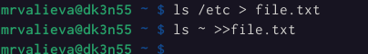{#fig:001 width=90%}

##

3. Выведим имена всех файлов из file.txt, имеющих расширение .conf, после чего запишем их в новый текстовой файл conf.txt.

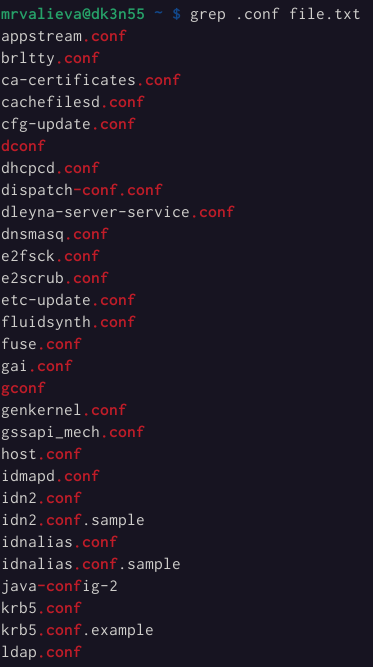{#fig:002 width=90%}

##

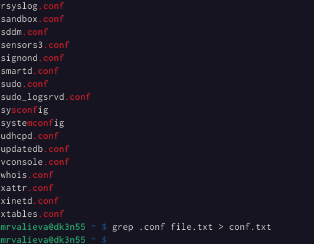{#fig:003 width=90%}

##

4. Определим, какие файлы в нашем домашнем каталоге имеют имена, начинавшиеся с символа c? Предложим несколько вариантов, как это сделать.

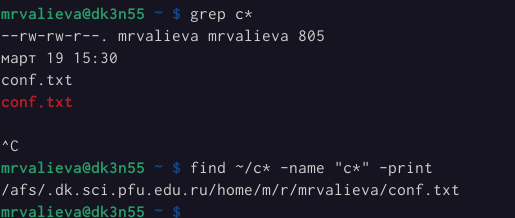{#fig:004 width=90%}

##

5. Выведим на экран (по странично) имена файлов из каталога /etc, начинающиеся с символа h.

{#fig:005 width=90%}

##

{#fig:006 width=90%}

##

6. Запустим в фоновом режиме процесс, который будет записывать в файл ~/logfile файлы, имена которых начинаются с log.
7. Удалим файл ~/logfile

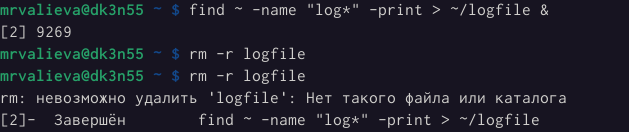{#fig:007 width=90%}

##

8. Запустим из консоли в фоновом режиме редактор gedit.

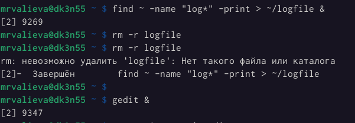{#fig:008 width=90%}

##

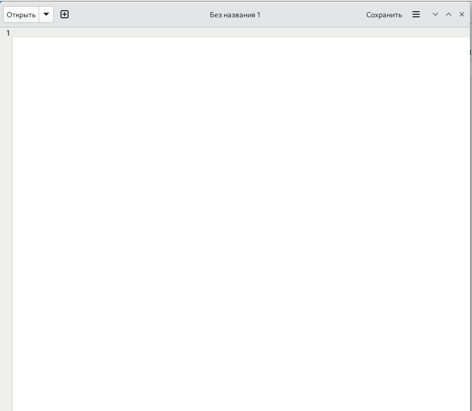{#fig:009 width=90%}

##

9. Определим идентификатор процесса gedit, используя команду ps, конвейер и фильтр grep. 

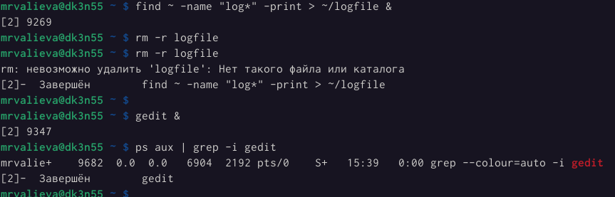{#fig:10 width=90%}

##

10. Прочтем справку (man) команды kill, после чего используем её для завершения процесса gedit.

{#fig:11 width=90%}

##

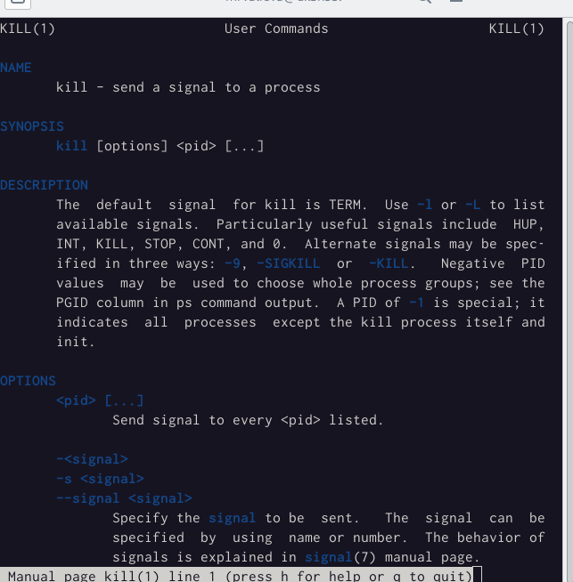{#fig:12 width=90%}

##

11. Выполним команды df и du, предварительно получив более подробную информацию об этих командах, с помощью команды man.

{#fig:13 width=90%}

##

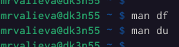{#fig:14 width=90%}

##

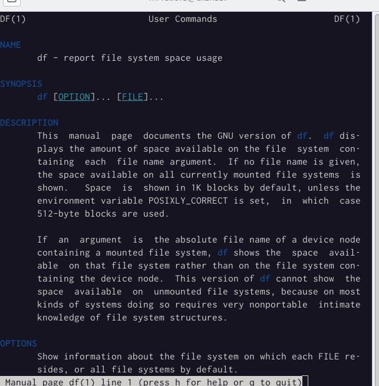{#fig:15 width=90%}

##

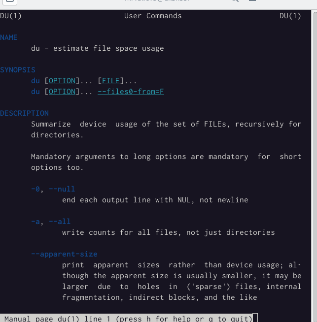{#fig:16 width=90%}

##

12. Воспользовавшись справкой команды find, выведем имена всех директорий, имеющихся в нашем домашнем каталоге.

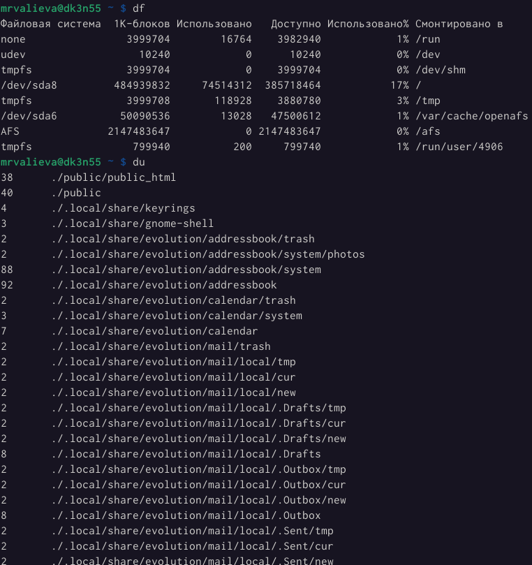{#fig:17 width=90%}

##

{#fig:18 width=90%}

##

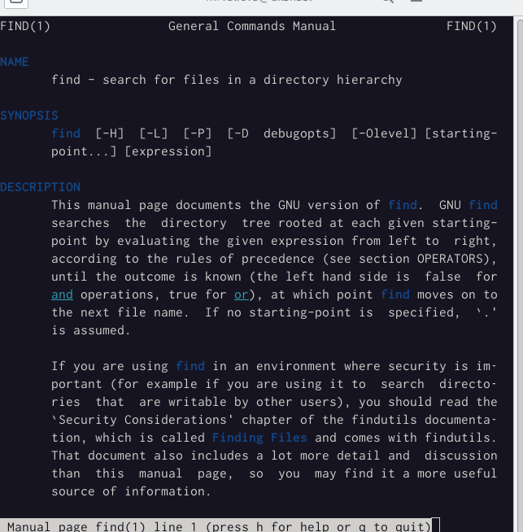{#fig:19 width=90%}

##

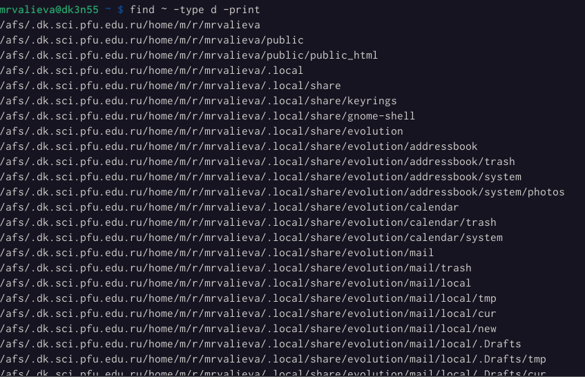{#fig:20 width=90%}

## Результаты

В результате данной лабораторной работы я ознакомилась с инструментами поиска файлов и фильтрации текстовых данных, приобрела практические навыки: по управлению процессами (и заданиями), по проверке использования диска и обслуживанию файловых систем.

