---
## Front matter
lang: ru-RU
title: Презентация по лабораторной работе №8
subtitle: Текстовой редактор vi
author:
  - Валиева М. Р.
institute:
  - Российский университет дружбы народов, Москва, Россия

## i18n babel
babel-lang: russian
babel-otherlangs: english

## Formatting pdf
toc: false
toc-title: Содержание
slide_level: 2
aspectratio: 169
section-titles: true
theme: metropolis
header-includes:
 - \metroset{progressbar=frametitle,sectionpage=progressbar,numbering=fraction}
 - '\makeatletter'
 - '\beamer@ignorenonframefalse'
 - '\makeatother'
---

## Докладчик

  * Валиева Марина Русланбековна
  * Российский университет дружбы народов
  * НБИбд-01-22

# Вводная часть

## Цели и задачи

Познакомиться с операционной системой Linux. Получить практические навыки работы с редактором vi, установленным по умолчанию практически во всех дистрибутивах.

# Результаты

## Получающиеся форматы

- Полученный `pdf`-файл можно демонстрировать в любой программе просмотра `pdf`
- Полученный `html`-файл содержит в себе все ресурсы: изображения, css, скрипты

## Цели и задачи

Познакомиться с операционной системой Linux. Получить практические навыки работы с редактором vi, установленным по умолчанию практически во всех дистрибутивах.

## Материалы и методы

Задание 1. Создание нового файла с использованием vi

1. Создадим каталог с именем ~/work/os/lab08.
2. Перейдем во вновь созданный каталог.

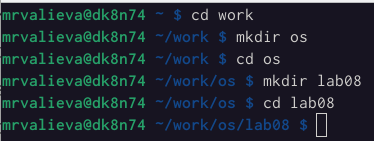{#fig:001 width=90%}

##

3. Вызовем vi и создадим файл hello.sh

{#fig:002 width=90%}

##

4. Нажмем клавишу i и введем текст.

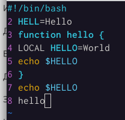{#fig:003 width=90%}

##

5. Нажмем клавишу Esc для перехода в командный режим после завершения ввода текста.

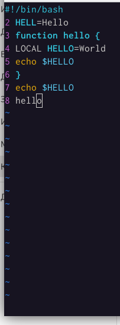{#fig:004 width=90%}

##

6. Нажмием : для перехода в режим последней строки и внизу нашего экрана появится приглашение в виде двоеточия.

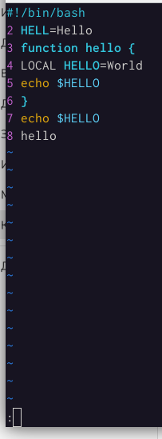{#fig:005 width=90%}

##

7. Нажмем w (записать) и q (выйти), а затем нажмем клавишу Enter для сохранения нашего текста и завершения работы.

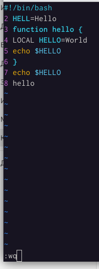{#fig:006 width=90%}

##

8. Сделаем файл исполняемым.

{#fig:007 width=90%}

##

Задание 2. Редактирование существующего файла

1. Вызовем vi на редактирование файла

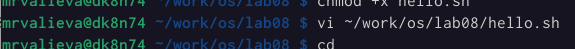{#fig:008 width=90%}

##

2. Установим курсор в конец слова HELL второй строки.

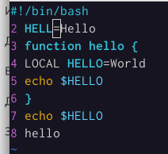{#fig:009 width=90%}

##

3. Перейдем в режим вставки и замените на HELLO. Нажмем Esc для возврата в командный режим.

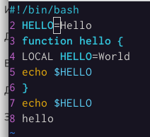{#fig:010 width=90%}

##

4. Установим курсор на четвертую строку и сотрем слово LOCAL.

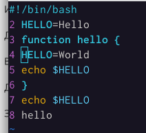{#fig:011 width=90%}

##

5. Перейдем в режим вставки и наберем следующий текст: local, нажмите Esc для возврата в командный режим.

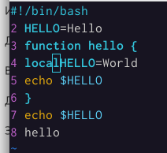{#fig:012 width=90%}

##

6. Установим курсор на последней строке файла. Вставим после неё строку, содержащую следующий текст: echo $HELLO.

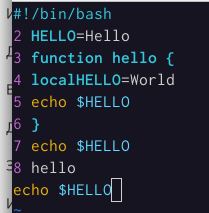{#fig:013 width=90%}

##

7. Нажмем Esc для перехода в командный режим.

8. Удалим последнюю строку.

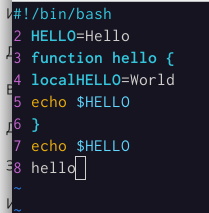{#fig:014 width=90%}

##

9. Введем команду отмены изменений u для отмены последней команды.

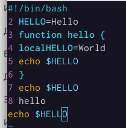{#fig:015 width=90%}

##

10. Введем символ : для перехода в режим последней строки. Запишем произведённые изменения и выйдем из vi

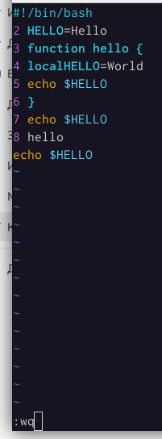{#fig:016 width=90%}

## Результаты

В итоге я познакомилась с операционной системой Linux. Получила практические навыки работы с редактором vi, установленным по умолчанию практически во всех дистрибутивах.

## Итоговый слайд

- Спасибо за внимание
