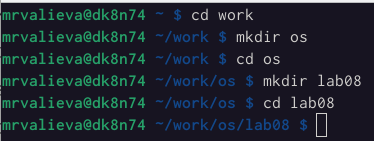
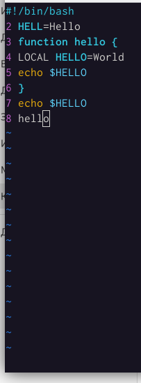
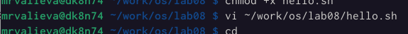
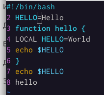
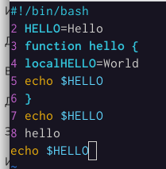
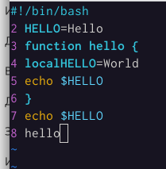
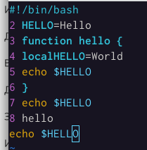

---
## Front matter
title: "Лабораторная работа No 8. "
subtitle: "Текстовой редактор vi"
author: "Валиева Марина Русланбековна"

## Generic otions
lang: ru-RU
toc-title: "Содержание"

## Bibliography
bibliography: bib/cite.bib
csl: pandoc/csl/gost-r-7-0-5-2008-numeric.csl

## Pdf output format
toc: true # Table of contents
toc-depth: 2
lof: true # List of figures
lot: true # List of tables
fontsize: 12pt
linestretch: 1.5
papersize: a4
documentclass: scrreprt
## I18n polyglossia
polyglossia-lang:
  name: russian
  options:
	- spelling=modern
	- babelshorthands=true
polyglossia-otherlangs:
  name: english
## I18n babel
babel-lang: russian
babel-otherlangs: english
## Fonts
mainfont: PT Serif
romanfont: PT Serif
sansfont: PT Sans
monofont: PT Mono
mainfontoptions: Ligatures=TeX
romanfontoptions: Ligatures=TeX
sansfontoptions: Ligatures=TeX,Scale=MatchLowercase
monofontoptions: Scale=MatchLowercase,Scale=0.9
## Biblatex
biblatex: true
biblio-style: "gost-numeric"
biblatexoptions:
  - parentracker=true
  - backend=biber
  - hyperref=auto
  - language=auto
  - autolang=other*
  - citestyle=gost-numeric
## Pandoc-crossref LaTeX customization
figureTitle: "Рис."
tableTitle: "Таблица"
listingTitle: "Листинг"
lofTitle: "Список иллюстраций"
lotTitle: "Список таблиц"
lolTitle: "Листинги"
## Misc options
indent: true
header-includes:
  - \usepackage{indentfirst}
  - \usepackage{float} # keep figures where there are in the text
  - \floatplacement{figure}{H} # keep figures where there are in the text
---

# Цель работы

Познакомиться с операционной системой Linux. Получить практические навыки работы с редактором vi, установленным по умолчанию практически во всех дистрибутивах.

# Задание

Задание 1. Создание нового файла с использованием vi
 
1. Создайте каталог с именем ~/work/os/lab06.

2. Перейдите во вновь созданный каталог.

3. Вызовите vi и создайте файл hello.sh
1 vi hello.sh

4. Нажмите клавишу i и вводите следующий текст.
1 #!/bin/bash
2 HELL=Hello
3 function hello {
4 LOCAL HELLO=World
5 echo $HELLO
6 }
7 echo $HELLO
8 hello

5. Нажмите клавишу Esc для перехода в командный режим после завершения ввода текста.

6. Нажмите : для перехода в режим последней строки и внизу вашего экрана появится приглашение в виде двоеточия.

7. Нажмите w (записать) и q (выйти), а затем нажмите клавишу Enter для сохранения вашего текста и завершения работы.

8. Сделайте файл исполняемым
1 chmod +x hello.sh

Задание 2. Редактирование существующего файла
1. Вызовите vi на редактирование файла
1 vi ~/work/os/lab06/hello.sh

2. Установите курсор в конец слова HELL второй строки.

3. Перейдите в режим вставки и замените на HELLO. Нажмите Esc для возврата в команд-
ный режим.

4. Установите курсор на четвертую строку и сотрите слово LOCAL.

5. Перейдите в режим вставки и наберите следующий текст: local, нажмите Esc для возврата в командный режим.

6. Установите курсор на последней строке файла. Вставьте после неё строку, содержащую следующий текст: echo $HELLO.

7. Нажмите Esc для перехода в командный режим.

8. Удалите последнюю строку.

9. Введите команду отмены изменений u для отмены последней команды.

10. Введите символ : для перехода в режим последней строки. Запишите произведённые изменения и выйдите из vi.

# Выполнение лабораторной работы

Задание 1. Создание нового файла с использованием vi

1. Создадим каталог с именем ~/work/os/lab08.
2. Перейдем во вновь созданный каталог.

{#fig:001 width=90%}

3. Вызовем vi и создадим файл hello.sh

{#fig:002 width=90%}

4. Нажмем клавишу i и введем текст.

{#fig:003 width=90%}

5. Нажмем клавишу Esc для перехода в командный режим после завершения ввода текста.

{#fig:004 width=90%}

6. Нажмием : для перехода в режим последней строки и внизу нашего экрана появится приглашение в виде двоеточия.

{#fig:005 width=90%}

7. Нажмем w (записать) и q (выйти), а затем нажмем клавишу Enter для сохранения нашего текста и завершения работы.

{#fig:006 width=90%}

8. Сделаем файл исполняемым.

{#fig:007 width=90%}

Задание 2. Редактирование существующего файла

1. Вызовем vi на редактирование файла

{#fig:008 width=90%}

2. Установим курсор в конец слова HELL второй строки.

{#fig:009 width=90%}

3. Перейдем в режим вставки и замените на HELLO. Нажмем Esc для возврата в командный режим.

{#fig:010 width=90%}

4. Установим курсор на четвертую строку и сотрем слово LOCAL.

{#fig:011 width=90%}

5. Перейдем в режим вставки и наберем следующий текст: local, нажмите Esc для возврата в командный режим.

{#fig:012 width=90%}

6. Установим курсор на последней строке файла. Вставим после неё строку, содержащую следующий текст: echo $HELLO.

{#fig:013 width=90%}

7. Нажмем Esc для перехода в командный режим.

8. Удалим последнюю строку.

{#fig:014 width=90%}

9. Введем команду отмены изменений u для отмены последней команды.

{#fig:015 width=90%}

10. Введем символ : для перехода в режим последней строки. Запишем произведённые изменения и выйдем из vi

{#fig:016 width=90%}

# Контрольные вопросы

1. Дайте краткую характеристику режимам работы редактора vi.
2. Как выйти из редактора, не сохраняя произведённые изменения?
3. Назовите и дайте краткую характеристику командам позиционирования.
4. Что для редактора vi является словом?
5. Каким образом из любого места редактируемого файла перейти в начало (конец) файла?
6. Назовите и дайте краткую характеристику основным группам команд редактирования.
7. Необходимо заполнить строку символами $. Каковы ваши действия?
8. Как отменить некорректное действие, связанное с процессом редактирования?
9. Назовите и дайте характеристику основным группам команд режима последней строки.
10. Как определить, не перемещая курсора, позицию, в которой заканчивается строка?
11. Выполните анализ опций редактора vi (сколько их, как узнать их назначение и т.д.).
12. Как определить режим работы редактора vi?
13. Постройте граф взаимосвязи режимов работы редактора vi

# Ответы 

1.    Краткая характеристика режимов работы редактора vi: – командный режим — предназначен для ввода команд редактирования и навигации по редактируемому файлу; – режим вставки — предназначен для ввода содержания редактируемого файла; – режим последней (или командной) строки — используется для записи изменений в файл и выхода из редактора.

2.    Выйти из редактора, не сохраняя произведённые изменения, можно используя клавиши «:q!» в командном режиме.

3.    Краткую характеристика команд позиционирования: – 0 (ноль) — переход в начало строки; – $ — переход в конец строки; – G — переход в конец файла; – n G — переход на строку с номером n.

4.    Для редактора vi словом является: пробел; буквы, находящиеся между двумя пробелами.

5.    Из любого места редактируемого файла перейти в конец файла можно с помощью клавишы G и курсора вниз, а в начало – курсор вверх.

6.    Краткая характеристика основных групп команд редактирования: Вставка текста – а — вставить текст после курсора; – А — вставить текст в конец строки; – i — вставить текст перед курсором; – n i — вставить текст n раз; – I — вставить текст в начало строки. Вставка строки – о — вставить строку под курсором; – О — вставить строку над курсором. Удаление текста – x — удалить один символ в буфер; – d w — удалить одно слово в буфер; – d $ — удалить в буфер текст от курсора до конца строки; – d 0 — удалить в буфер текст от начала строки до позиции курсора; – d d — удалить в буфер одну строку; – n d d — удалить в буфер n строк. Отмена и повтор произведённых изменений – u — отменить последнее изменение; – . — повторить последнее изменение. Копирование текста в буфер – Y — скопировать строку в буфер; – n Y — скопировать n строк в буфер; – y w — скопировать слово в буфер. Вставка текста из буфера – p — вставить текст из буфера после курсора; – P — вставить текст из буфера перед курсором. Замена текста – c w — заменить слово; – n c w — заменить n слов; – c $ — заменить текст от курсора до конца строки; – r — заменить слово; – R — заменить текст. Поиск текста – / текст — произвести поиск вперёд по тексту указанной строки символов текст; – ? текст — произвести поиск назад по тексту указанной строки символов текст.

7.    Чтобы заполнить строку символами $ можно использовать клавиши ni(вставить текст n раз).

8.    Отменить некорректное действие, связанное с процессом редактирования, можно с помощью клавиши «.».

9.    Характеристика основных групп команд режима последней строки: Копирование и перемещение текста – : n,m d — удалить строки с n по m; – : i,j m k — переместить строки с i по j, начиная со строки k; – : i,j t k — копировать строки с i по j в строку k; – : i,j w имя-файла — записать строки с i по j в файл с именем имя-файла. Запись в файл и выход из редактора – : w — записать изменённый текст в файл, не выходя из vi; – : w имя-файла — записать изменённый текст в новый файл с именем имяфайла; – : w ! имя-файла — записать изменённый текст в файл с именем имяфайла; – : w q — записать изменения в файл и выйти из vi; – : q — выйти из редактора vi; – : q ! — выйти из редактора без записи; – : e ! — вернуться в командный режим, отменив все изменения, произведённые со времени последней записи.

10.    Определить, не перемещая курсора, позицию, в которой заканчивается строка, можно используя клавишу $ (переход в конец строки).

11.    Опции редактора vi позволяют настроить рабочую среду. Для задания опций используется команда set (в режиме последней строки): – : set all — вывести полный список опций; – : set nu — вывести номера строк; – : set list — вывести невидимые символы; – : set ic — не учитывать при поиске, является ли символ прописным или строчным. Если вы хотите отказаться от использования опции, то в команде set перед именем опции надо поставить no.

12.    Определить режим работы редактора vi можно по последней командной строке.

13.    Взаимосвязь режимов работы редактора vi: «Командный режим» - «Режим вставки» \ / «Режим командной строки»

# Выводы

В итоге я познакомилась с операционной системой Linux. Получила практические навыки работы с редактором vi, установленным по умолчанию практически во всех дистрибутивах.
