---
## Front matter
lang: ru-RU
title: Лабораторная работа №9
subtitle: Текстовой редактор emacs
author:
  - Валиева Марина Русланбековна
institute:
  - Российский университет дружбы народов, Москва, Россия

## i18n babel
babel-lang: russian
babel-otherlangs: english

## Formatting pdf
toc: false
toc-title: Содержание
slide_level: 2
aspectratio: 169
section-titles: true
theme: metropolis
header-includes:
 - \metroset{progressbar=frametitle,sectionpage=progressbar,numbering=fraction}
 - '\makeatletter'
 - '\beamer@ignorenonframefalse'
 - '\makeatother'
---


## Докладчик


  * Валиева Марина Русланбековна
  * НБИбд-01-22
  * Российский университет дружбы народов


# Вводная часть


## Цели и задачи

Познакомиться с операционной системой Linux. Получить практические навыки работы с редактором Emacs.


# Создание презентации

## Процессор `pandoc`

- Pandoc: преобразователь текстовых файлов
- Сайт: <https://pandoc.org/>
- Репозиторий: <https://github.com/jgm/pandoc>

## Формат `pdf`

- Использование LaTeX
- Пакет для презентации: [beamer](https://ctan.org/pkg/beamer)
- Тема оформления: `metropolis`

## Код для формата `pdf`

```yaml
slide_level: 2
aspectratio: 169
section-titles: true
theme: metropolis
```


# Результаты


## Содержание исследования

# Выполнение лабораторной работы

1. Открыла emacs.

{#fig:001 width=90%}

##

2. Создала файл lab07.sh с помощью комбинации Ctrl-x Ctrl-f (C-x C-f).

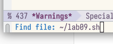{#fig:002 width=90%}

##

3. Набрала текст.

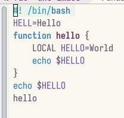{#fig:003 width=90%}

##

4. Сохранила файл с помощью комбинации Ctrl-x Ctrl-s (C-x C-s).

5. Проделала с текстом стандартные процедуры редактирования, каждое действие должно осуществляться комбинацией клавиш.
5.1. Вырезала одной командой целую строку (С-k).

##

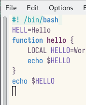{#fig:004 width=90%}

##

5.2. Вставила эту строку в конец файла (C-y).

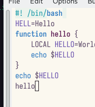{#fig:005 width=90%}

##

5.3. Выделила область текста (C-space).

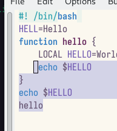{#fig:006 width=90%}

##

5.4. Скопировала область в буфер обмена (M-w).

5.5. Вставила область в конец файла.

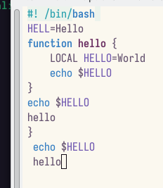{#fig:007 width=90%}

##

5.6. Вновь выделила эту область и на этот раз вырезала её (C-w).

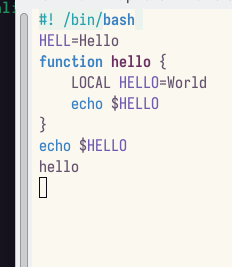{#fig:008  width=90%}

##

5.7. Отменила последнее действие (C-/).

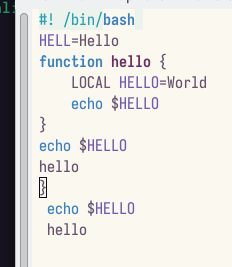{#fig:009 width=90%}

##

6. Научилась использовать команды по перемещению курсора.
6.1. Переместила курсор в начало строки (C-a).

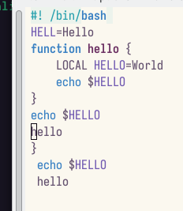{#fig:010 width=90%}

##

6.2. Переместила курсор в конец строки (C-e).

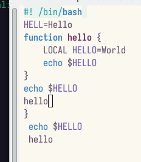{#fig:011 width=90%}

##

6.3. Переместила курсор в начало буфера (M-<).
6.4. Переместила курсор в конец буфера (M->).

##

7. Управление буферами.
7.1. Вывела список активных буферов на экран (C-x C-b).

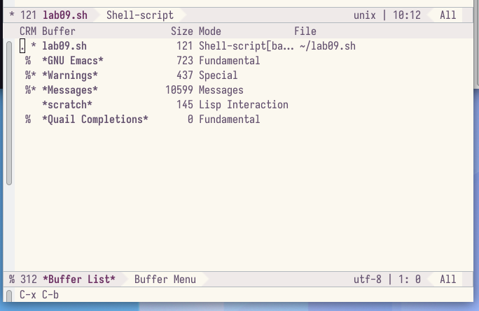{#fig:012 width=90%}

##

7.2. Переместилась во вновь открытое окно (C-x) o со списком открытых буферов и переключилась на другой буфер.
7.3. Закрыла это окно (C-x 0).

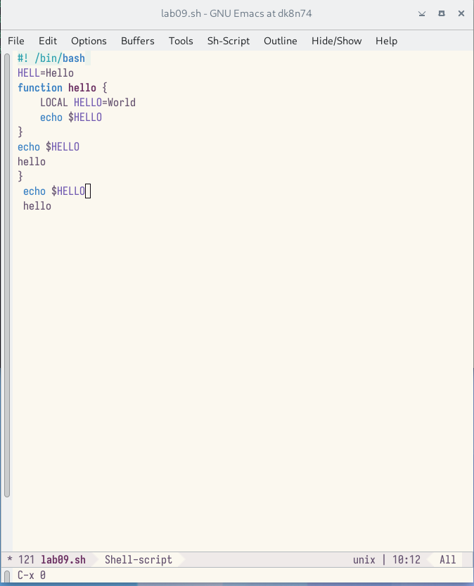{#fig:013 width=90%}

##

7.4. Теперь вновь переключилась между буферами, но уже без вывода их списка на экран (C-x b).

##

8. Управление окнами.
8.1. Поделила фрейм на 4 части: разделила фрейм на два окна по вертикали (C-x 3), а затем каждое из этих окон на две части по горизонтали (C-x 2)

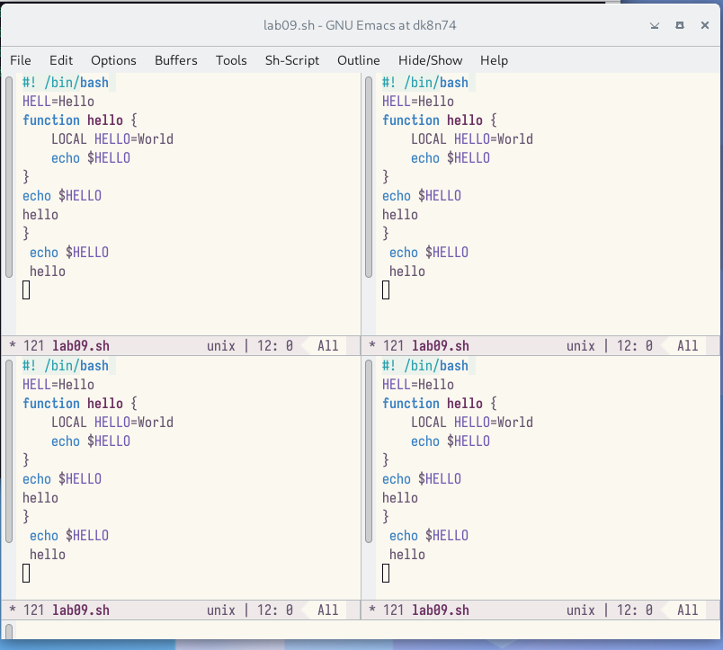{#fig:014 width=90%}

##
 
8.2. В каждом из четырёх созданных окон открыла новый буфер (файл) и ввела несколько строк текста.

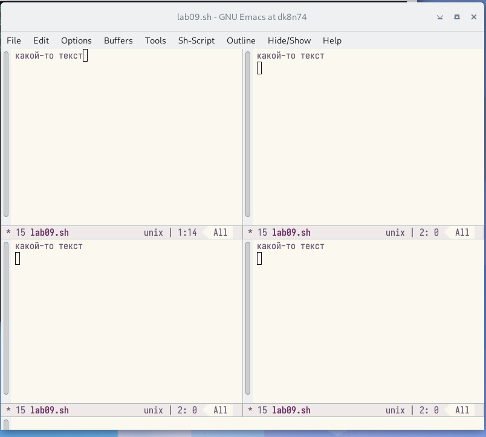{#fig:015 width=90%}

##

9. Режим поиска
9.1. Переключилась в режим поиска (C-s) и нашла несколько слов, присутствующих в тексте.

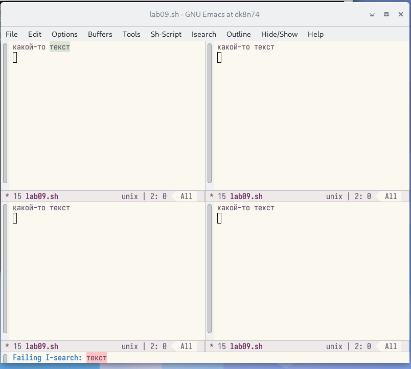{#fig:016 width=90%}

##

9.2. Переключилась между результатами поиска, нажимая C-s.
9.3. Вышла из режима поиска, нажав C-g.
9.4. Перешла в режим поиска и замены (M-%), ввела текст, который следует найти и заменить, нажала Enter , затем ввела текст для замены. После того как были подсвечены результаты поиска, нажала ! для подтверждения замены.

##

9.5. Испробоывала другой режим поиска, нажав M-s o. 

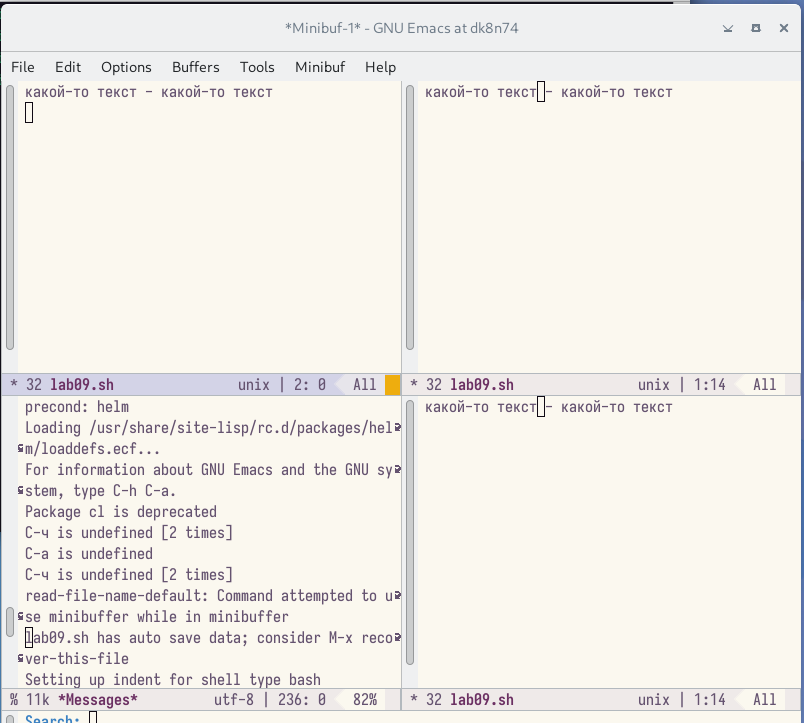{#fig:017 width=90%}


## Результаты

В итоге я познакомилась с операционной системой linux. получила практические навыки работы с редактором emacs.


## Итоговый слайд

- Спасибо за внимание
