---
## Front matter
title: "Лабораторная работа No 9."
subtitle: "Текстовой редактор emacs"
author: "Валиева Марина Русланбековна"

## Generic otions
lang: ru-RU
toc-title: "Содержание"

## Bibliography
bibliography: bib/cite.bib
csl: pandoc/csl/gost-r-7-0-5-2008-numeric.csl

## Pdf output format
toc: true # Table of contents
toc-depth: 2
lof: true # List of figures
lot: true # List of tables
fontsize: 12pt
linestretch: 1.5
papersize: a4
documentclass: scrreprt
## I18n polyglossia
polyglossia-lang:
  name: russian
  options:
	- spelling=modern
	- babelshorthands=true
polyglossia-otherlangs:
  name: english
## I18n babel
babel-lang: russian
babel-otherlangs: english
## Fonts
mainfont: PT Serif
romanfont: PT Serif
sansfont: PT Sans
monofont: PT Mono
mainfontoptions: Ligatures=TeX
romanfontoptions: Ligatures=TeX
sansfontoptions: Ligatures=TeX,Scale=MatchLowercase
monofontoptions: Scale=MatchLowercase,Scale=0.9
## Biblatex
biblatex: true
biblio-style: "gost-numeric"
biblatexoptions:
  - parentracker=true
  - backend=biber
  - hyperref=auto
  - language=auto
  - autolang=other*
  - citestyle=gost-numeric
## Pandoc-crossref LaTeX customization
figureTitle: "Рис."
tableTitle: "Таблица"
listingTitle: "Листинг"
lofTitle: "Список иллюстраций"
lotTitle: "Список таблиц"
lolTitle: "Листинги"
## Misc options
indent: true
header-includes:
  - \usepackage{indentfirst}
  - \usepackage{float} # keep figures where there are in the text
  - \floatplacement{figure}{H} # keep figures where there are in the text
---

# Цель работы

Познакомиться с операционной системой Linux. Получить практические навыки работы с редактором Emacs.

# Задание

1. Ознакомиться с теоретическим материалом.
2. Ознакомиться с редактором emacs.
3. Выполнить упражнения.
4. Ответить на контрольные вопросы

# Выполнение лабораторной работы

1. Открыла emacs.

{#fig:001 width=90%}

2. Создала файл lab07.sh с помощью комбинации Ctrl-x Ctrl-f (C-x C-f).

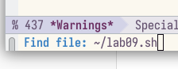{#fig:002 width=90%}

3. Набрала текст.

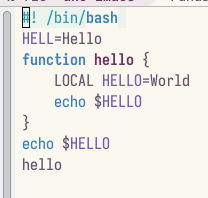{#fig:003 width=90%}

4. Сохранила файл с помощью комбинации Ctrl-x Ctrl-s (C-x C-s).

5. Проделала с текстом стандартные процедуры редактирования, каждое действие должно осуществляться комбинацией клавиш.
5.1. Вырезала одной командой целую строку (С-k).

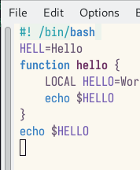{#fig:004 width=90%}

5.2. Вставила эту строку в конец файла (C-y).

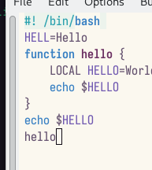{#fig:005 width=90%}

5.3. Выделила область текста (C-space).

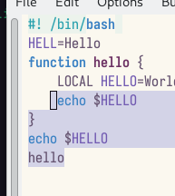{#fig:006 width=90%}

5.4. Скопировала область в буфер обмена (M-w).

5.5. Вставила область в конец файла.

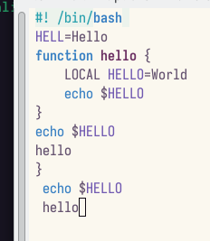{#fig:007 width=90%}

5.6. Вновь выделила эту область и на этот раз вырезала её (C-w).

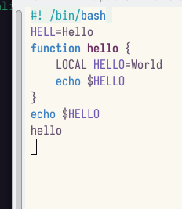{#fig:008  width=90%}

5.7. Отменила последнее действие (C-/).

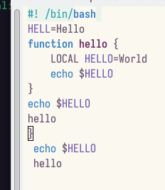{#fig:009 width=90%}

6. Научилась использовать команды по перемещению курсора.
6.1. Переместила курсор в начало строки (C-a).

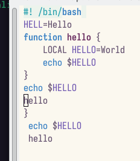{#fig:010 width=90%}

6.2. Переместила курсор в конец строки (C-e).

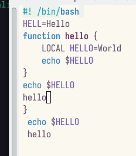{#fig:011 width=90%}

6.3. Переместила курсор в начало буфера (M-<).
6.4. Переместила курсор в конец буфера (M->).

7. Управление буферами.
7.1. Вывела список активных буферов на экран (C-x C-b).

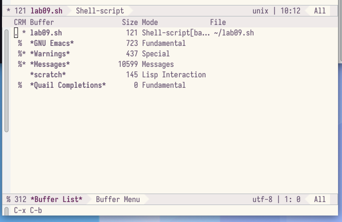{#fig:012 width=90%}

7.2. Переместилась во вновь открытое окно (C-x) o со списком открытых буферов и переключилась на другой буфер.
7.3. Закрыла это окно (C-x 0).

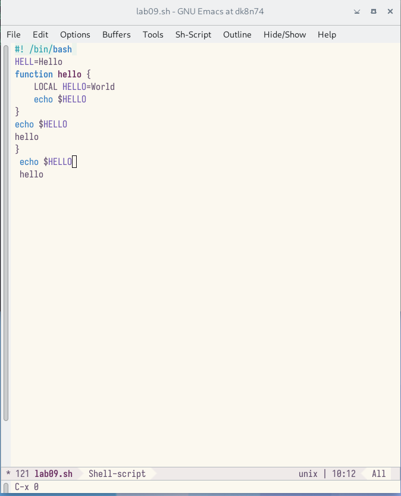{#fig:013 width=90%}

7.4. Теперь вновь переключилась между буферами, но уже без вывода их списка на экран (C-x b).

8. Управление окнами.
8.1. Поделила фрейм на 4 части: разделила фрейм на два окна по вертикали (C-x 3), а затем каждое из этих окон на две части по горизонтали (C-x 2)

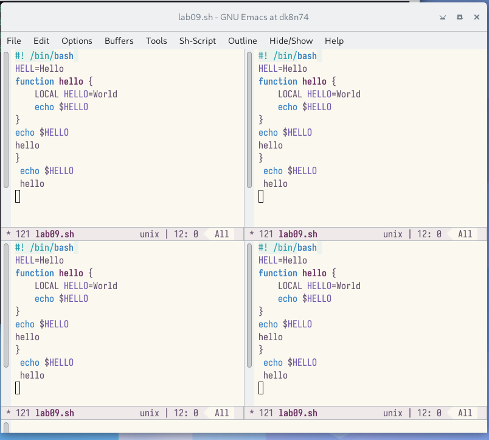{#fig:014 width=90%}
 
8.2. В каждом из четырёх созданных окон открыла новый буфер (файл) и ввела несколько строк текста.

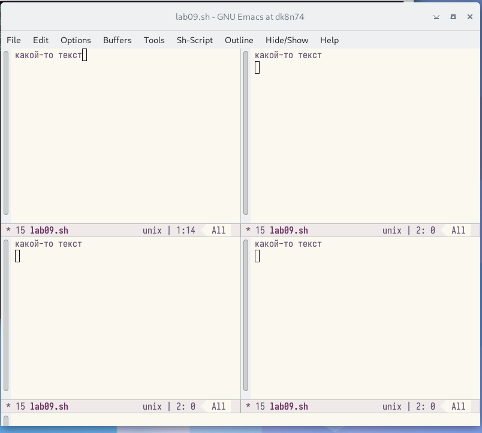{#fig:015 width=90%}

9. Режим поиска
9.1. Переключилась в режим поиска (C-s) и нашла несколько слов, присутствующих в тексте.

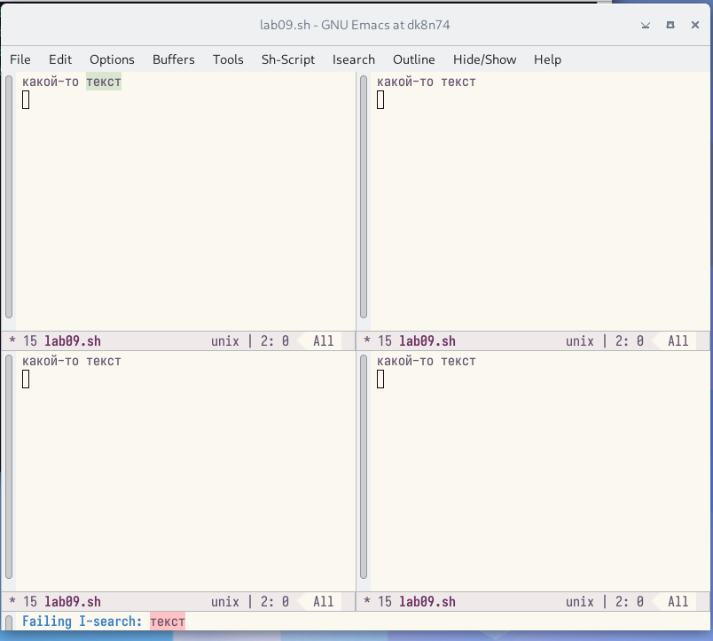{#fig:016 width=90%}

9.2. Переключилась между результатами поиска, нажимая C-s.
9.3. Вышла из режима поиска, нажав C-g.
9.4. Перешла в режим поиска и замены (M-%), ввела текст, который следует найти и заменить, нажала Enter , затем ввела текст для замены. После того как были подсвечены результаты поиска, нажала ! для подтверждения замены.
9.5. Испробоывала другой режим поиска, нажав M-s o. 

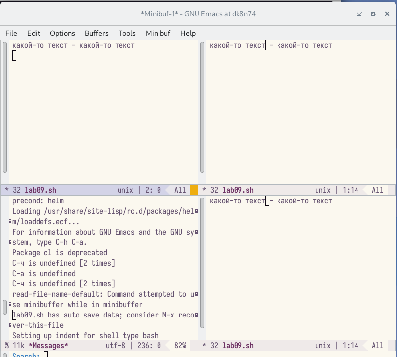{#fig:017 width=90%}

# Контрольные вопросы

    Кратко охарактеризуйте редактор emacs.

    Какие особенности данного редактора могутсделать его сложным для освоения но- вичком?

    Своими словами опишите,чтотакое буфер и окно втерминологии emacs’а.

    Можно ли открыть больше 10 буферов в одном окне?

    Какие буферы создаются по умолчанию при запуске emacs?

    Какие клавиши вы нажмёте,чтобы ввести следующую комбинацию C-c | и C-c C-|?

    Как поделитьтекущее окно на две части?

    В каком файле хранятся настройки редактора emacs?

    Какую функцию выполняет клавиша и можно ли её переназначить?

    Какой редактор вам показался удобнее в работе vi или emacs? Поясните почему.

# Ответы на контрольные вопросы:

    Emacs представляет собой мощный экранный редактор текста, написанный на языке высокого уровня Elisp.

    Развитие Emacs в сторону его многогранности послужило причиной того, что и без того интуитивно непонятная программа стала чрезвычайно сложной в применении. В частности, управление осуществляется при помощи различных клавиатурных комбинаций, запомнить которые будет непросто.

    Буфер – что-то, состоящее из текста. Окно – область с одним из буферов.

    В одном окне можно открыть больше 10 буферов.

    После запуска emacs без каких-либо параметров в основном окне отображается буфер scratch, который используется для оценки выражений Emacs Lisp, а также для заметок, которые вы не хотите сохранять. Этот буфер не сохраняется автоматически.

    Чтобы ввести следующую комбинацию C-c | я нажму клавиши: Control+c и Shift+, и для C-c C-|: Control+c и Control+Shift+.

    Поделить текущее окно на две части можно двумя комбинациями клавиш: C-x 3 или C-x 2.

    Настроить или расширить Emacs можно написав или изменив файл ~/.emacs.

    Клавиша  выполняет функцию перемещения курсора в открытом окне также, как и многие другие клавиши её можно переназначить.

    Редактор emacs показался мне удобнее из-за возможности открытия нескольких окон с буферами и работать комбинациями клавиш в этот редакторе мне было проще.

# Выводы

В итоге я познакомилась с операционной системой linux. получила практические навыки работы с редактором emacs.
