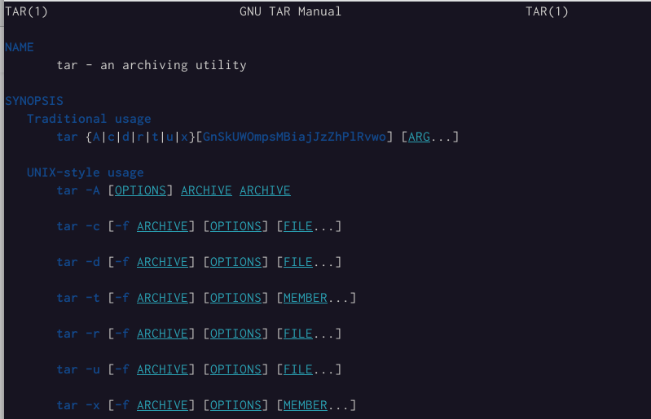
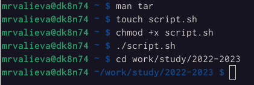
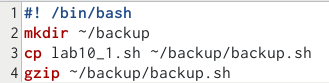
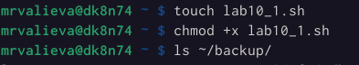
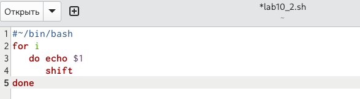
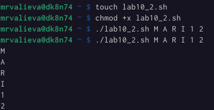
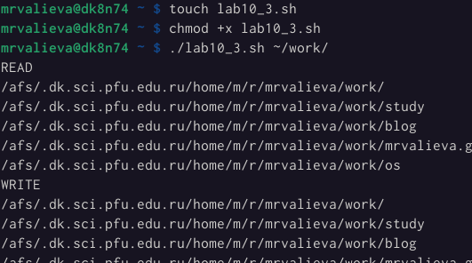
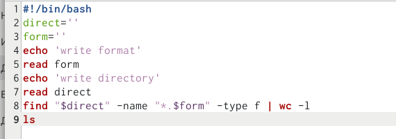
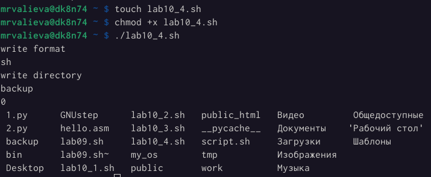

---
## Front matter
lang: ru-RU
title: Лабораторная работа №10
subtitle: Программирование в командном процессоре ОС UNIX. Командные файлы
author:
  - Валиева М. Р.
institute:
  - Российский университет дружбы народов, Москва, Россия

## i18n babel
babel-lang: russian
babel-otherlangs: english

## Formatting pdf
toc: false
toc-title: Содержание
slide_level: 2
aspectratio: 169
section-titles: true
theme: metropolis
header-includes:
 - \metroset{progressbar=frametitle,sectionpage=progressbar,numbering=fraction}
 - '\makeatletter'
 - '\beamer@ignorenonframefalse'
 - '\makeatother'
---

## Докладчик

  * Валиева Марина Руслабековна
  * НБИбд-01-22
  * Российский университет дружбы народов

# Вводная часть

## Цели и задачи

Изучить основы программирования в оболочке ОС UNIX/Linux. Научиться писать небольшие командные файлы.

# Создание презентации

# Результаты

## Получающиеся форматы

- Полученный `pdf`-файл можно демонстрировать в любой программе просмотра `pdf`
- Полученный `html`-файл содержит в себе все ресурсы: изображения, css, скрипты

# Элементы презентации

## Актуальность

- Даёт понять, о чём пойдёт речь
- Следует широко и кратко описать проблему
- Мотивировать свое исследование
- Сформулировать цели и задачи
- Возможна формулировка ожидаемых результатов

## Цели и задачи

Изучить основы программирования в оболочке ОС UNIX/Linux. 
Научиться писать небольшие командные файлы.

## Материалы и методы

1. Написала скрипт, который при запуске делает резервную копию самого себя (то есть файла, в котором содержится его исходный код) в другую директорию backup в нашем домашнем каталоге. При этом файл архивируется одним из архиваторов на выбор zip, bzip2 или tar. Способ использования команд архивации узнали, изучив справку.

{#fig:001 width=90%}

##

{#fig:002 width=90%}

##

{#fig:003 width=90%}

##

{#fig:004 width=90%}

##

2. Написали пример командного файла, обрабатывающего любое произвольное число аргументов командной строки, в том числе превышающее десять. Например, скрипт может последовательно распечатывать значения всех переданных аргументов.

{#fig:005 width=90%}

##

{#fig:006 width=90%}

##

3. Написали командный файл — аналог команды ls (без использования самой этой команды и команды dir). Требуется, чтобы он выдавал информацию о нужном каталоге и выводил информацию о возможностях доступа к файлам этого каталога.

{#fig:007 width=90%}

##

4. Написали командный файл, который получает в качестве аргумента командной строки формат файла (.txt, .doc, .jpg, .pdf и т.д.) и вычисляет количество таких файлов в указанной директории. Путь к директории также передаётся в виде аргумента командной строки.

{#fig:008 width=90%}

##

{#fig:009 width=90%}

## Результаты

- Не нужны все результаты
- Необходимы логические связки между слайдами
- Необходимо показать понимание материала

## Итоговый слайд

Спасибо за внимание!
