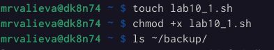

---
## Front matter
title: "Лабораторная работа №10"
subtitle: "Программирование в командном процессоре ОС UNIX. Командные файлы"
author: "Марина Русланбековна Валиева"

## Generic otions
lang: ru-RU
toc-title: "Содержание"

## Bibliography
bibliography: bib/cite.bib
csl: pandoc/csl/gost-r-7-0-5-2008-numeric.csl

## Pdf output format
toc: true # Table of contents
toc-depth: 2
lof: true # List of figures
lot: true # List of tables
fontsize: 12pt
linestretch: 1.5
papersize: a4
documentclass: scrreprt
## I18n polyglossia
polyglossia-lang:
  name: russian
  options:
	- spelling=modern
	- babelshorthands=true
polyglossia-otherlangs:
  name: english
## I18n babel
babel-lang: russian
babel-otherlangs: english
## Fonts
mainfont: PT Serif
romanfont: PT Serif
sansfont: PT Sans
monofont: PT Mono
mainfontoptions: Ligatures=TeX
romanfontoptions: Ligatures=TeX
sansfontoptions: Ligatures=TeX,Scale=MatchLowercase
monofontoptions: Scale=MatchLowercase,Scale=0.9
## Biblatex
biblatex: true
biblio-style: "gost-numeric"
biblatexoptions:
  - parentracker=true
  - backend=biber
  - hyperref=auto
  - language=auto
  - autolang=other*
  - citestyle=gost-numeric
## Pandoc-crossref LaTeX customization
figureTitle: "Рис."
tableTitle: "Таблица"
listingTitle: "Листинг"
lofTitle: "Список иллюстраций"
lotTitle: "Список таблиц"
lolTitle: "Листинги"
## Misc options
indent: true
header-includes:
  - \usepackage{indentfirst}
  - \usepackage{float} # keep figures where there are in the text
  - \floatplacement{figure}{H} # keep figures where there are in the text
---

# Цель работы

Изучить основы программирования в оболочке ОС UNIX/Linux. Научиться писать небольшие командные файлы.

# Задание

1. Написать скрипт, который при запуске будет делать резервную копию самого себя (то есть файла, в котором содержится его исходный код) в другую директорию backup в вашем домашнем каталоге. При этом файл должен архивироваться одним из архиваторов на выбор zip, bzip2 или tar. Способ использования команд архивации необходимо узнать, изучив справку.
2. Написать пример командного файла, обрабатывающего любое произвольное число аргументов командной строки, в том числе превышающее десять. Например, скрипт может последовательно распечатывать значения всех переданных аргументов.
3. Написать командный файл — аналог команды ls (без использования самой этой команды и команды dir). Требуется, чтобы он выдавал информацию о нужном каталоге и выводил информацию о возможностях доступа к файлам этого каталога.
4. Написать командный файл, который получает в качестве аргумента командной строки формат файла (.txt, .doc, .jpg, .pdf и т.д.) и вычисляет количество таких файлов в указанной директории. Путь к директории также передаётся в виде аргумента командной строки.


# Выполнение лабораторной работы

1. Написала скрипт, который при запуске делает резервную копию самого себя (то есть файла, в котором содержится его исходный код) в другую директорию backup в нашем домашнем каталоге. При этом файл архивируется одним из архиваторов на выбор zip, bzip2 или tar. Способ использования команд архивации узнали, изучив справку.

{#fig:001 width=90%}
{#fig:002 width=90%}
{#fig:003 width=90%}
{#fig:004 width=90%}

2. Написали пример командного файла, обрабатывающего любое произвольное число аргументов командной строки, в том числе превышающее десять. Например, скрипт может последовательно распечатывать значения всех переданных аргументов.

{#fig:005 width=90%}
{#fig:006 width=90%}

3. Написали командный файл — аналог команды ls (без использования самой этой команды и команды dir). Требуется, чтобы он выдавал информацию о нужном каталоге и выводил информацию о возможностях доступа к файлам этого каталога.

{#fig:007 width=90%}

4. Написали командный файл, который получает в качестве аргумента командной строки формат файла (.txt, .doc, .jpg, .pdf и т.д.) и вычисляет количество таких файлов в указанной директории. Путь к директории также передаётся в виде аргумента командной строки.

{#fig:008 width=90%}
{#fig:009 width=90%}

# Контрольные вопросы

1. Объясните понятие командной оболочки. Приведите примеры командных оболочек.
Чем они отличаются?
2. Что такое POSIX?
3. Как определяются переменные и массивы в языке программирования bash?
4. Каково назначение операторов let и read?
5. Какие арифметические операции можно применять в языке программирования bash?
6. Что означает операция (( ))?
7. Какие стандартные имена переменных Вам известны?
8. Что такое метасимволы?
9. Как экранировать метасимволы?
10. Как создавать и запускать командные файлы?
11. Как определяются функции в языке программирования bash?
12. Каким образом можно выяснить, является файл каталогом или обычным файлом?
13. Каково назначение команд set, typeset и unset?
14. Как передаются параметры в командные файлы?
15. Назовите специальные переменные языка bash и их назначение.

# Ответы на контрольные вопросы

1. 
a)	sh — стандартная командная оболочка UNIX/Linux, содержащая базовый, 	полный набор функций
b)	csh — использующая С-подобный синтаксис команд с возможностью 	сохранения истории выполнения команд
c)	ksh — напоминает оболочку С, но операторы управления программой 	совместимы с операторами оболочки Борна
d)	bash — сокращение от Bourne Again Shell (опять оболочка Борна), в основе 	своей совмещает свойства оболочек С и Корна

2. 
 POSIX (Portable Operating System Interface for Computer Environments) — набор  стандартов описания интерфейсов взаимодействия операционной системы и прикладных программ.

3. 
Переменные вызываются $var, где var=чему-то, указанному пользователем, неважно что бы то не было, название файла, каталога или еще чего.
Для массивов используется команда set -A

4. 
 let — вычисляет далее заданное математическое значение
read — позволяет читать значения переменных со стандартного ввода

5. 
Прибавление, умножение, вычисление, 	деление), сравнение значений, экспонирование и др.

6. 
Это обозначение используется для облегчения программирования для условий bash 

7. 
Нам известны HOME, PATH, BASH, ENV, PWD, UID, OLDPWD, PPID, GROUPS, OSTYPE, PS1 - PS4, LANG, HOSTFILE, MAIL, TERM, LOGNAME, USERNAME, IFS и др.

8. 
Метасимволы это специальные знаки, которые могут использоваться для сокращения пути, 	поиска объекта по расширению, перед переменными, например «$» или «*» .

9. 
Добавить перед метасимволом метасимвол «\»

10. 
При помощи команды chmod. Надо дать права на запуск chmod +x название файла, затем запустить bash  ./название файла
Например у нас файл lab
Пишем: 
chmod +x lab
./lab

11. 
Объединяя несколько команд с помощью function

12. 
Можно задать команду на проверку диретория ли это test -d директория

13. 
Set — используется для создания массивов
Unset — используется для изъятия переменной
Typeset — используется для присваивания каких-либо функций

14. 
Добавлением аршументов после команды запуска bash скрипта

15.  
```
–	$* — отображается вся командная строка или параметры оболочки;
–	$? — код завершения последней выполненной команды;
–	$$ — уникальный идентификатор процесса, в рамках которого выполняется командный процессор;
–	$! — номер процесса, в рамках которого выполняется последняя вызванная на выполнение в командном режиме команда;
–	$- — значение флагов командного процессора;
–	${#*} — возвращает целое число — количество слов, которые были результатом
$*;
–	${#name} — возвращает целое значение длины строки в переменной name;
–	${name[n]} — обращение к n-му элементу массива;
–	${name[*]} — перечисляет все элементы массива, разделённые пробелом;
–	${name[@]} — то же самое, но позволяет учитывать символы пробелы в самих переменных;
–	${name:-value}—еслизначениепеременнойnameнеопределено,тоонобудет заменено на указанное value;
–	${name:value} — проверяется факт существования переменной;
–	${name=value} — если name не определено, то ему присваивается значение value;
–	${name?value} — останавливает выполнение, если имя переменной не определено, и выводит value как сообщение об ошибке;
–	${name+value} — это выражение работает противоположно ${name-value}. Если переменная определена, то подставляется value;
–	${name#pattern} — представляет значение переменной name с удалённым самым коротким левым образцом (pattern);
–	${#name[*]}и${#name[@]}—этивыражениявозвращаютколичествоэлементов в массиве name.
```

# Выводы

В итоге я изучила основы программирования в оболочке ОС UNIX/Linux и научилась писать небольшие командные файлы.
