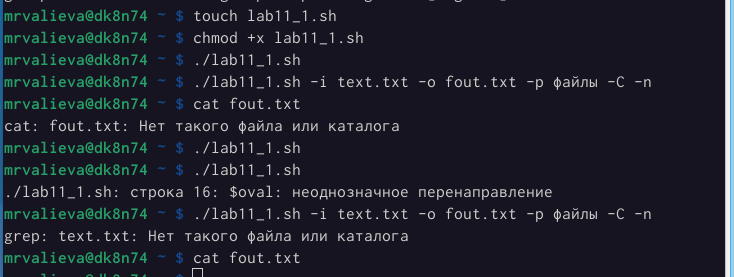
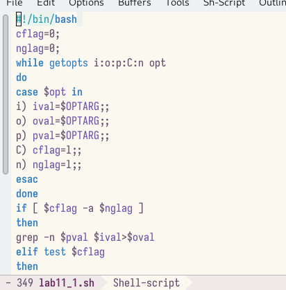
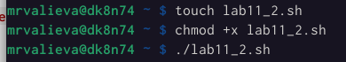
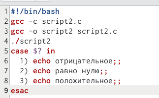
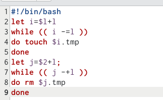
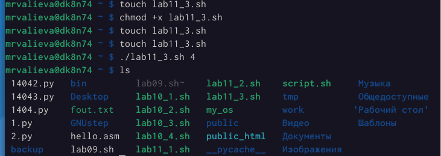
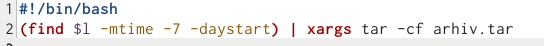
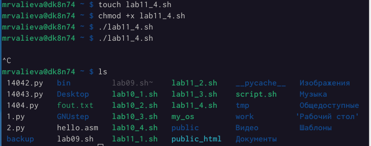

---
## Front matter
lang: ru-RU
title: Лабораторная работа №11
subtitle: Программирование в командном процессоре ОС UNIX. Ветвления и циклы
author:
  - Валиева М. Р.
institute:
  - Российский университет дружбы народов, Москва, Россия


## i18n babel
babel-lang: russian
babel-otherlangs: english

## Formatting pdf
toc: false
toc-title: Содержание
slide_level: 2
aspectratio: 169
section-titles: true
theme: metropolis
header-includes:
 - \metroset{progressbar=frametitle,sectionpage=progressbar,numbering=fraction}
 - '\makeatletter'
 - '\beamer@ignorenonframefalse'
 - '\makeatother'
---

# Информация

## Докладчик


  * Валиева Марина Русланбековна
  * НБИбд-01-22
  * Российский университет дружбы народов

# Вводная часть

## Цели и задачи

Изучить основы программирования в оболочке ОС UNIX. Научится писать более сложные командные файлы с использованием логических управляющих конструкций и циклов.

# Создание презентации

# Элементы презентации

## Цели и задачи

Изучить основы программирования в оболочке ОС UNIX. Научится писать более сложные командные файлы с использованием логических управляющих конструкций и циклов.

## Материалы и методы

1. Используя команды getopts grep напишем командный файл, который анализирует командную строку с ключами и выполним его: 
	-i inputfile — прочитать данные из указанного файла; 
	-o outputfile — вывести данные в указанный файл; 
	-p шаблон — указать шаблон для поиска; 
	-C — различать большие и малые буквы; 
	-n — выдавать номера строк; 

а затем ищет в указанном файле нужные строки

##
 
```
#!/bin/bash
cflag=0;
nflag=0;
while getopts i:o:p:C:n opt
do
case $opt in
i) ival=$OPTARG;;
o) oval=$OPTARG;;
p) pval=$OPTARG;;
C) cflag=1;;
n) nflag=1;;
esac
done
if [ $cflag -a $nflag ]
then
grep -n $pval $ival>$oval
elif test $cflag
then
grep $pval $ival>$oval
elif test $nflag
then
grep -n -i $pval $ival>$oval
else
grep -i $pval $ival>$oval
fi
```
##

{ #fig:001 width=70% }

##

{ #fig:002 width=70% }

##

2. Напишем сначала на языке Си программу, которая вводит число и определяет, является ли оно больше нуля, меньше нуля или равно нулю. Затем завершим программу при помощи функции exit(n), передавая информацию о коде завершения в оболочку. Командный файл вызовет эту программу и, проанализировав с помощью команды $?, выдаст сообщение о том, какое число было введено

##

```
#!/bin/bash
gcc -c script2.c
gcc -o script2 script2.c
./script2
case $? in
	1) echo отрицательное;;
	2) echo равно нулю;;
	3) echo положительное;;
esac
```

##

{ #fig:003 width=70% }

##

{ #fig:004 width=70% }

##

3. Напишем командный файл, создающий указанное число файлов, пронумерованных последовательно от 1 до N  

```
#!/bin/bash
let i=$1+1
while (( i-=1 ))
do touch $i.tmp
done
let j=$2+1;
while (( j-=1 ))
do rm $j.tmp
done
```

##

{ #fig:005 width=70% }

##

{ #fig:006 width=70% }

##

4. Напишем командный файл, который с помощью команды tar запаковывает в архив все файлы в указанной директории. Модифицируем его так, чтобы запаковывались только те файлы, которые были изменены менее недели тому назад. 

##

```
#!/bin/bash
(find $1 -mtime -7 -daystart) | xargs tar -cf arhiv.tar
```

##

{ #fig:007 width=70% }

##

{ #fig:008 width=70% }

## Результаты

Изучила основы программирования в оболочке ОС UNIX. Научилась писать более сложные командные файлы с использованием логических управляющих конструкций и циклов.

## Итоговый слайд

Спасибо за внимание!
