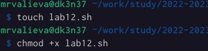
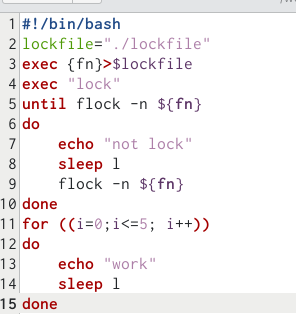
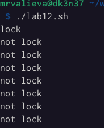
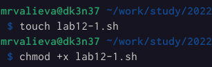
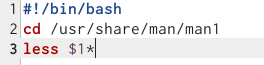
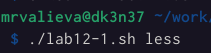
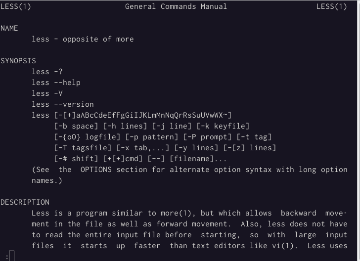
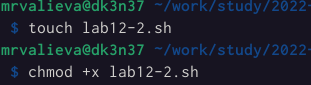
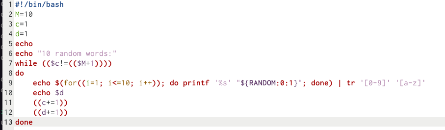
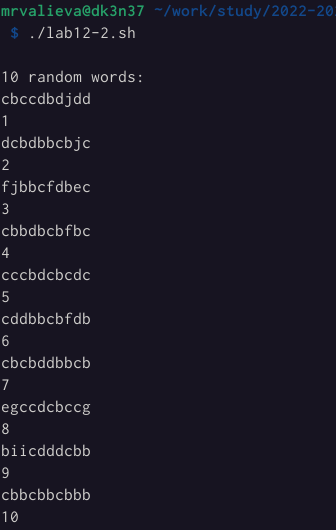

---
## Front matter
lang: ru-RU
title: Лабораторная работа № 12
subtitle: Программирование в командном процессоре ОС UNIX. Расширенное программирование
author:
  - Валиева Марина Русланбековна
institute:
  - Российский университет дружбы народов, Москва, Россия

## i18n babel
babel-lang: russian
babel-otherlangs: english

## Formatting pdf
toc: false
toc-title: Содержание
slide_level: 2
aspectratio: 169
section-titles: true
theme: metropolis
header-includes:
 - \metroset{progressbar=frametitle,sectionpage=progressbar,numbering=fraction}
 - '\makeatletter'
 - '\beamer@ignorenonframefalse'
 - '\makeatother'
---

# Информация

## Докладчик

  * Валиева Марина Русланбековна
  * НБИбд-01-22
  * Российский университет дружбы народов

# Результаты

## Цели и задачи

Изучить основы программирования в оболочке ОС UNIX. 
Научиться писать более сложные командные файлы с использованием логических управляющих конструкций и циклов.

## Материалы и методы

1. Написала командный файл, реализующий упрощённый механизм семафоров. Командный файл должен в течение некоторого времени t1 дожидаться освобождения ресурса, выдавая об этом сообщение, а дождавшись его освобождения, использовать его в течение некоторого времени t2<>t1, также выдавая информацию о том, что ресурс используется соответствующим командным файлом (процессом). Запустила командный файл в одном виртуальном терминале в фоновом режиме, перенаправив его вывод в другой (> /dev/tty#, где # — номер терминала куда перенаправляется вывод), в котором также запущен этот файл, но не фоновом, а в привилегированном режиме. Доработала программу так, чтобы имелась возможность взаимодействия трёх и более процессов.

##

{#fig:001 width=90%}

##

{#fig:002 width=90%}

##

{#fig:003 width=90%}

##

2. Реализовала команду man с помощью командного файла. Изучила содержимое каталога /usr/share/man/man1. В нем находятся архивы текстовых файлов, содержащих справку по большинству установленных в системе программ и команд. Каждый архив можно открыть командой less сразу же просмотрев содержимое справки. Командный файл должен получать в виде аргумента командной строки название команды и в виде результата выдавать справку об этой команде или сообщение об отсутствии справки, если соответствующего файла нет в каталоге man1.

##

{#fig:003 width=90%}

##

{#fig:004 width=90%}

##

{#fig:005 width=90%}

##

{#fig:006 width=90%}

##

{#fig:007 width=90%}

##

3. Используя встроенную переменную $RANDOM, написала командный файл, генерирующий случайную последовательность букв латинского алфавита. Учтем, что $RANDOM выдаёт псевдослучайные числа в диапазоне от 0 до 32767.

##

{#fig:008 width=90%}

##

{#fig:009 width=90%}

##

{#fig:010 width=90%}

## Результаты

Изучила основы программирования в оболочке ОС UNIX. Научилась писать более сложные командные файлы с использованием логических управляющих конструкций и циклов.

## Итоговый слайд

Спасибо за внимание!
