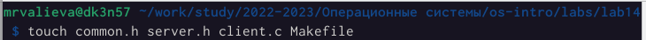
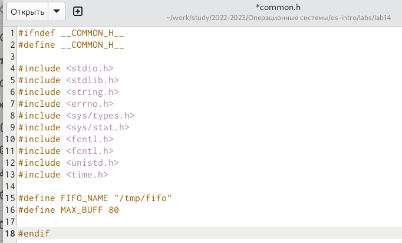
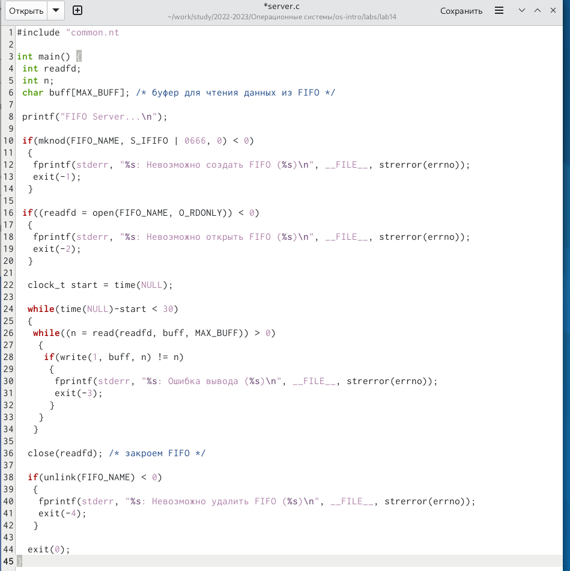
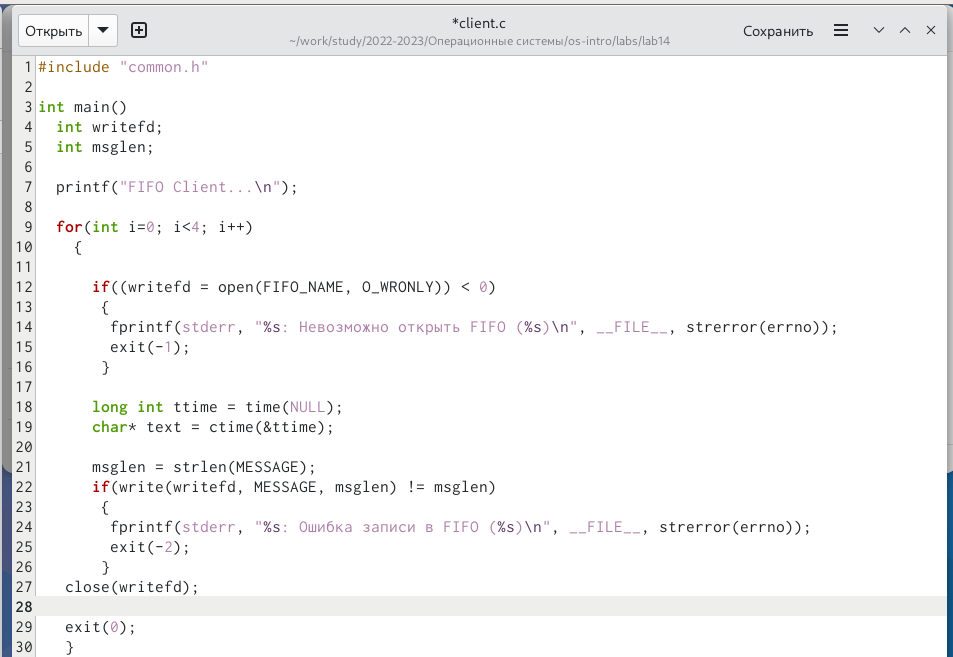
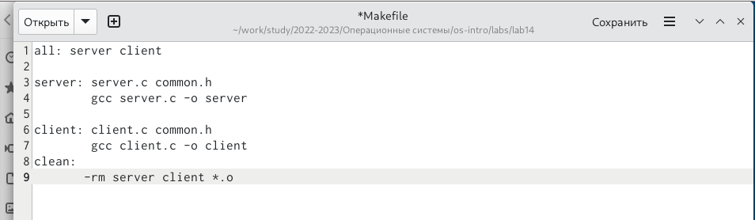
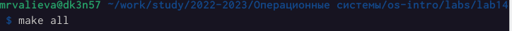
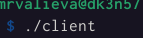

---
## Front matter
lang: ru-RU
title: Лабораторная работа No 14.
subtitle: Именованные каналы
author:
  - Валиева М. Р.
institute:
  - Российский университет дружбы народов, Москва, Россия

## i18n babel
babel-lang: russian
babel-otherlangs: english

## Formatting pdf
toc: false
toc-title: Содержание
slide_level: 2
aspectratio: 169
section-titles: true
theme: metropolis
header-includes:
 - \metroset{progressbar=frametitle,sectionpage=progressbar,numbering=fraction}
 - '\makeatletter'
 - '\beamer@ignorenonframefalse'
 - '\makeatother'
---

# Информация

## Докладчик

  * Валиева Марина Русланбековна
  * НБИбд-01-22
  * Российский университет дружбы народов

# Вводная часть

## Цели и задачи

Приобретение практических навыков работы с именованными каналами.

# Результаты

# Элементы презентации

## Материалы и методы

1. Для начала я создала необходимые файлы с помощью команды touch и открыла редактор emacs для их редактирования.

##

{#fig:001 width=90%}

##

2. Далее я изменила коды программ, представленных в лабораторной работе.  В файл common.h добавила стандартные заголовочные файлы unistd.h и time.h, необходимые для работы кодов других файлов. Common.h предназначен для заголовочных файлов, чтобы в остальных программах их не прописывать каждый раз.

##

{#fig:002 width=90%}

##

В файл server.c добавила цикл while для контроля за временем работы сервера. Разница между текущим временем time(NULL) и временем начала работы clock_t start=time(NULL) (инициализация до цикла) не должна превышать 30 секунд.

##

{#fig:003 width=90%}

##

В файл client.c добавила цикл, который отвечает за количество сообщений о текущем времени (4 сообщения), которое получается в результате выполнения команд, и команду sleep(5) для приостановки работы клиента на 5 секунд.

##

{#fig:004 width=90%}

##

Makefile (файл для сборки) не изменяла

{#fig:005 width=90%}

## 

3. После написания кодов, я, используя команду «make all», скомпилировала необходимые файлы

{#fig:006 width=90%}

##

{#fig:007 width=90%}

##

{#fig:008 width=90%}

##

Далее я проверила работу написанного кода. Отрыла 3 консоли (терминала) и запустила: в первом терминале − «./server», в остальных двух – «./client». В результате каждый терминал-клиент вывел по 4 сообщения. Спустя 30 секунд работа сервера была прекращена. Программа работает корректно.

## Результаты

В результате данной лабораторной работы я приобрела практические навыки работы с именованными каналами.

## Итоговый слайд

Спасибо за внимание!
