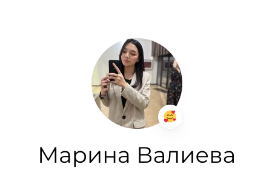
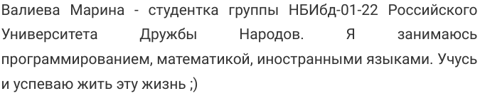
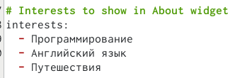
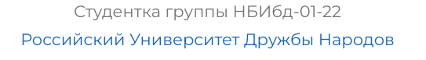
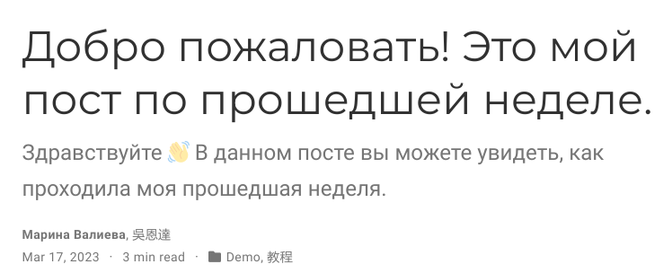
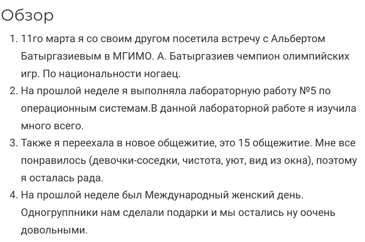
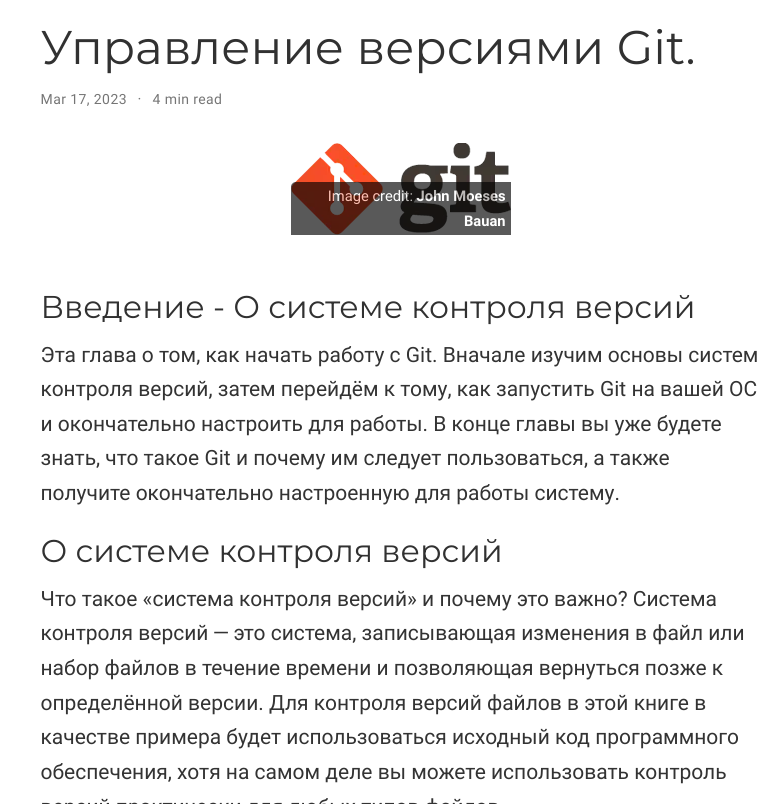

---
## Front matter
lang: ru-RU
title: Отчет о выполнении 2 этапа
subtitle: Индивидуальный проект. Этап 2
author:
  - Валиева М. Р.
institute:
  - Российский университет дружбы народов, Москва, Россия

## i18n babel
babel-lang: russian
babel-otherlangs: english

## Formatting pdf
toc: false
toc-title: Содержание
slide_level: 2
aspectratio: 169
section-titles: true
theme: metropolis
header-includes:
 - \metroset{progressbar=frametitle,sectionpage=progressbar,numbering=fraction}
 - '\makeatletter'
 - '\beamer@ignorenonframefalse'
 - '\makeatother'
---

## Докладчик

  * Валиева Марина Русланбековна
  * студент группы НБИбд-01-22
  * направление Бизнес-информатика
  * Российский университет дружбы народов

## Цели и задачи

Добавление к сайту данных о себе.

## Цели и задачи

- Не формулируйте более 1--2 целей исследования

## Материалы и методы

1. Разместим фотографию владельца сайта.

{#fig:001 width=90%}

##

2. Разместим краткое описание владельца сайта.

{#fig:002 width=90%}

##

3. Добавим информацию об интересах.

{#fig:003 width=90%}

##

4. Добавим информацию от образовании.

{#fig:004 width=90%}

##

5. Сделаем пост по прошедшей неделе.

{#fig:005 width=90%}

##

{#fig:006 width=90%}

##

6. Пост на тему по выбору.

{#fig:007 width=90%}

## Результаты

В результате 2го этапа индивидуального проекта я поняла, как добавить на сайт данные о себе.
