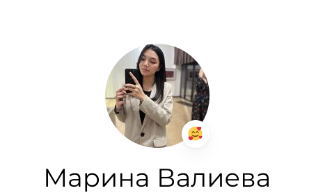
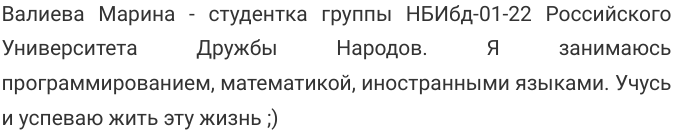
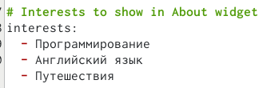
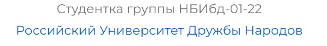
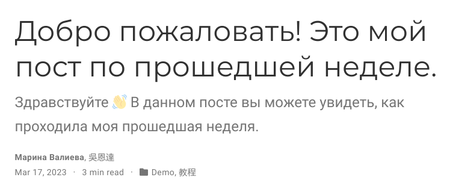
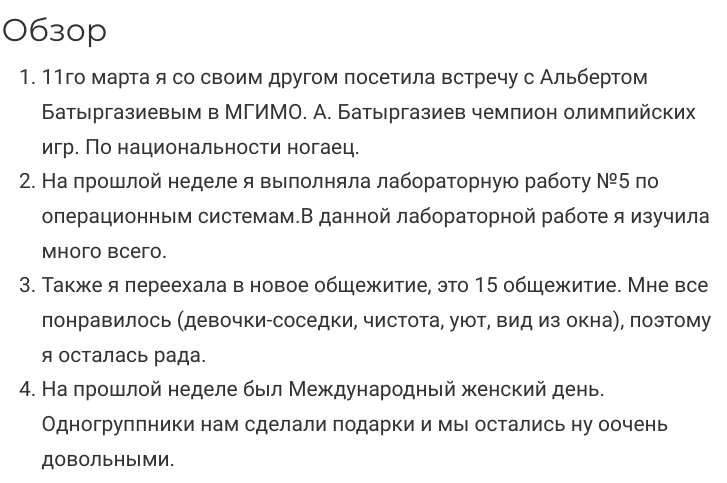
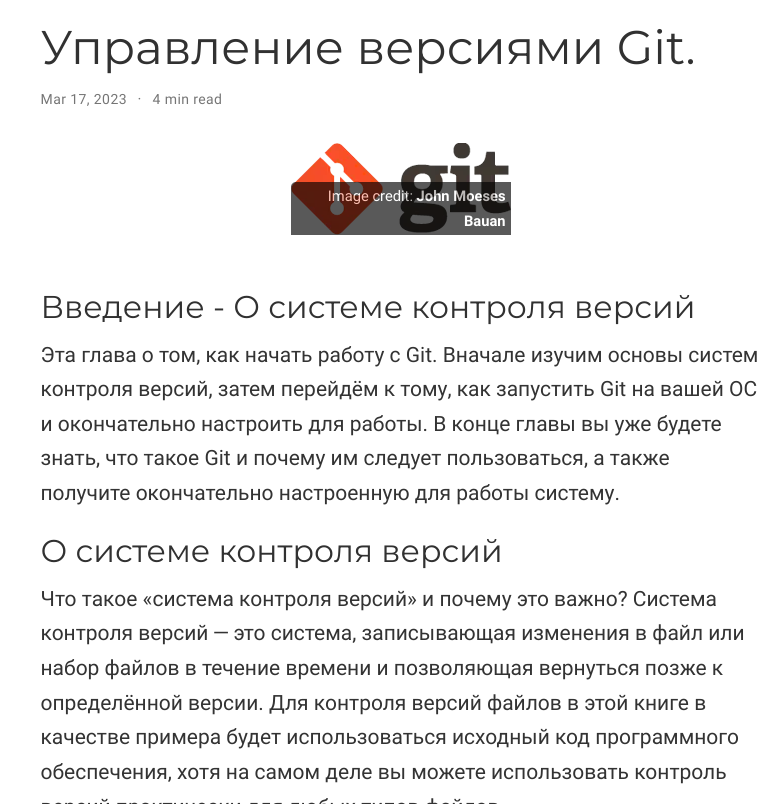

---
## Front matter
title: "Отчет о выполнении 2 этапа"
subtitle: "Индивидуальный проект. Этап 2"
author: "Валиева Марина Русланбековна"

## Generic otions
lang: ru-RU
toc-title: "Содержание"

## Bibliography
bibliography: bib/cite.bib
csl: pandoc/csl/gost-r-7-0-5-2008-numeric.csl

## Pdf output format
toc: true # Table of contents
toc-depth: 2
lof: true # List of figures
lot: true # List of tables
fontsize: 12pt
linestretch: 1.5
papersize: a4
documentclass: scrreprt
## I18n polyglossia
polyglossia-lang:
  name: russian
  options:
	- spelling=modern
	- babelshorthands=true
polyglossia-otherlangs:
  name: english
## I18n babel
babel-lang: russian
babel-otherlangs: english
## Fonts
mainfont: PT Serif
romanfont: PT Serif
sansfont: PT Sans
monofont: PT Mono
mainfontoptions: Ligatures=TeX
romanfontoptions: Ligatures=TeX
sansfontoptions: Ligatures=TeX,Scale=MatchLowercase
monofontoptions: Scale=MatchLowercase,Scale=0.9
## Biblatex
biblatex: true
biblio-style: "gost-numeric"
biblatexoptions:
  - parentracker=true
  - backend=biber
  - hyperref=auto
  - language=auto
  - autolang=other*
  - citestyle=gost-numeric
## Pandoc-crossref LaTeX customization
figureTitle: "Рис."
tableTitle: "Таблица"
listingTitle: "Листинг"
lofTitle: "Список иллюстраций"
lotTitle: "Список таблиц"
lolTitle: "Листинги"
## Misc options
indent: true
header-includes:
  - \usepackage{indentfirst}
  - \usepackage{float} # keep figures where there are in the text
  - \floatplacement{figure}{H} # keep figures where there are in the text
---

# Цель работы

Добавление к сайту данных о себе.

# Задание

Добавить к сайту данные о себе.

    Список добавляемых данных.
       Разместить фотографию владельца сайта.
       Разместить краткое описание владельца сайта (Biography).
       Добавить информацию об интересах (Interests).
       Добавить информацию от образовании (Education).
    Сделать пост по прошедшей неделе.
    Добавить пост на тему по выбору:
       Управление версиями. Git.
       Непрерывная интеграция и непрерывное развертывание (CI/CD).

# Выполнение лабораторной работы

1. Разместим фотографию владельца сайта.

{#fig:001 width=90%}

2. Разместим краткое описание владельца сайта.

{#fig:002 width=90%}

3. Добавим информацию об интересах.

{#fig:003 width=90%}

4. Добавим информацию от образовании.

{#fig:004 width=90%}

5. Сделаем пост по прошедшей неделе.

{#fig:005 width=90%}

{#fig:006 width=90%}

6. Пост на тему по выбору.

{#fig:007 width=90%}

# Выводы

В результате 2го этапа индивидуального проекта я поняла, как добавить на сайт данные о себе.
