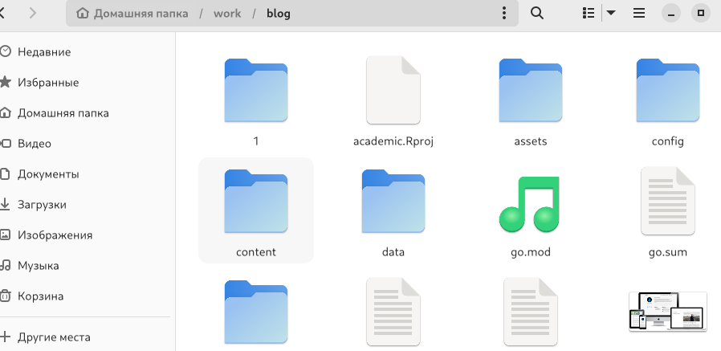
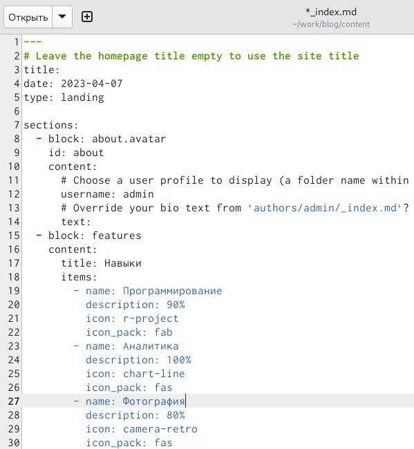
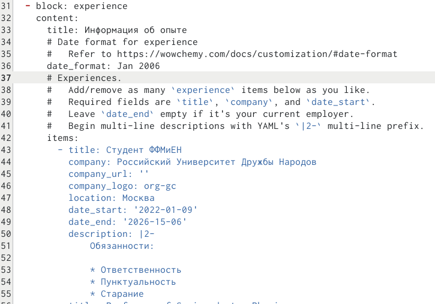
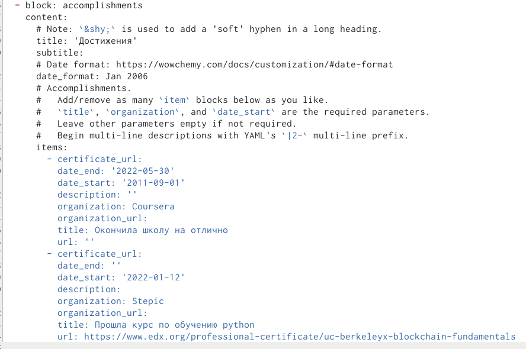
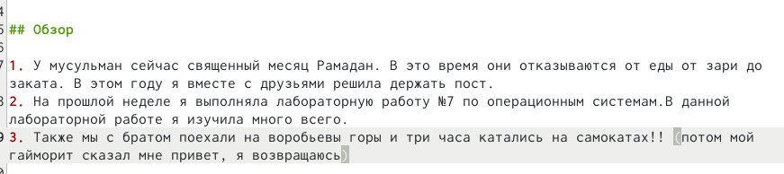
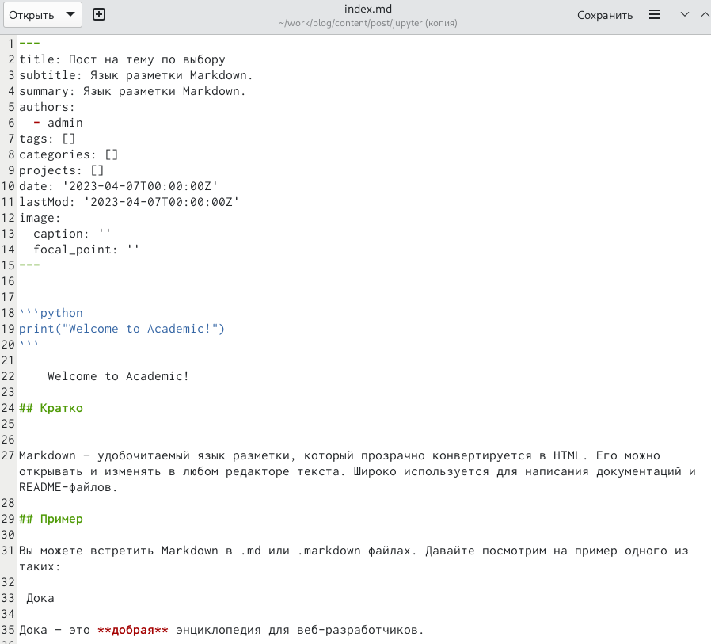
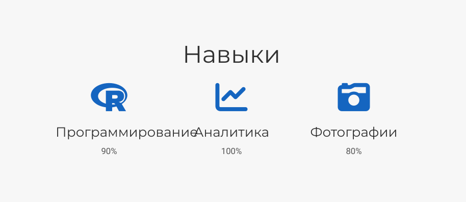
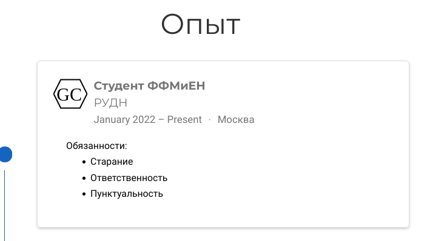
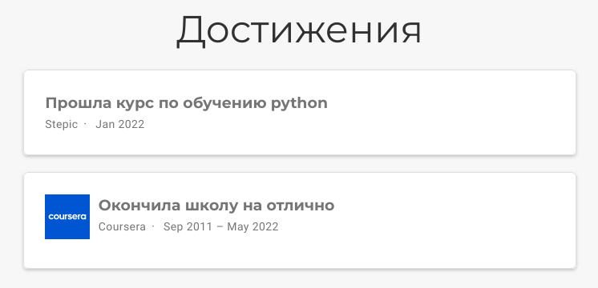
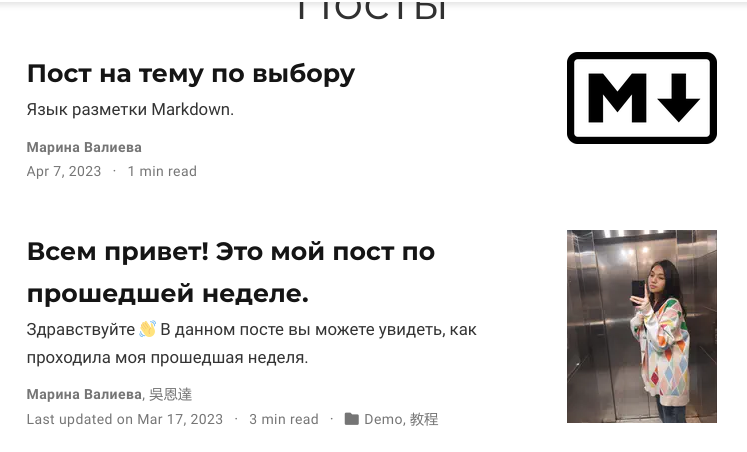

---
## Front matter
lang: ru-RU
title: Третий этап индивидуального проекта
subtitle: Добавление к сайту достижений
author:
  - Валиева М. Р.
institute:
  - Российский университет дружбы народов, Москва, Россия

## i18n babel
babel-lang: russian
babel-otherlangs: english

## Formatting pdf
toc: false
toc-title: Содержание
slide_level: 2
aspectratio: 169
section-titles: true
theme: metropolis
header-includes:
 - \metroset{progressbar=frametitle,sectionpage=progressbar,numbering=fraction}
 - '\makeatletter'
 - '\beamer@ignorenonframefalse'
 - '\makeatother'
---

# Информация

## Докладчик

  * Валиева Марина Русланбековна
  * студент ФФМиЕН
  * Российский университет дружбы народов

# Вводная часть

## Цели и задачи

Доюавление достижений на сайт.

## Материалы и методы

- Процессор `pandoc` для входного формата Markdown
- Результирующие форматы
	- `pdf`
	- `html`
- Автоматизация процесса создания: `Makefile`

# Создание презентации

## Материалы и методы

Захожу в папку блог и ищу необходимые мне папки (навыки, опыт и достижения)

{#fig:001 width=90%}

##

Далее пишу свои навыки. Также сразу пишу опыт и достижения.

{#fig:002 width=90%}

##

{#fig:003 width=90%}

##

{#fig:004 width=90%}

##

Далее добавляю пост по прошедшей неделе.

{#fig:005 width=90%}

##

Добавляю пост по выбранной мной теме.

{#fig:006 width=90%}

##

Итоговый результат:

{#fig:007 width=90%}

##

{#fig:008 width=90%}

##

{#fig:009 width=90%}

##

{#fig:010 width=90%}

## Результаты

Добавила на сайт достижения

## Итоговый слайд

Спасибо за внимание!
