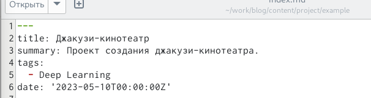
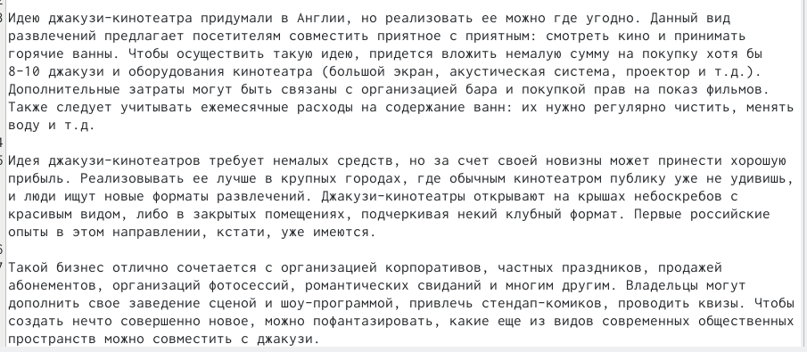
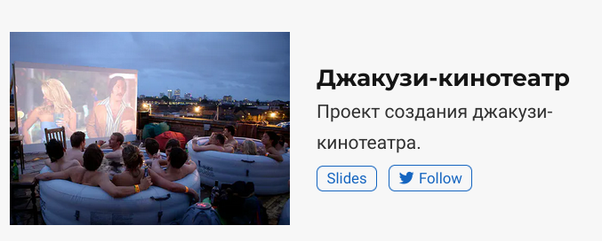
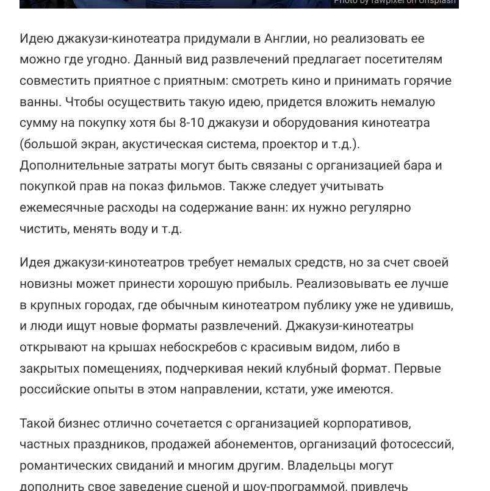
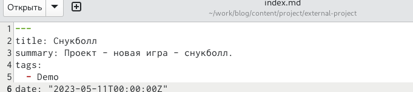
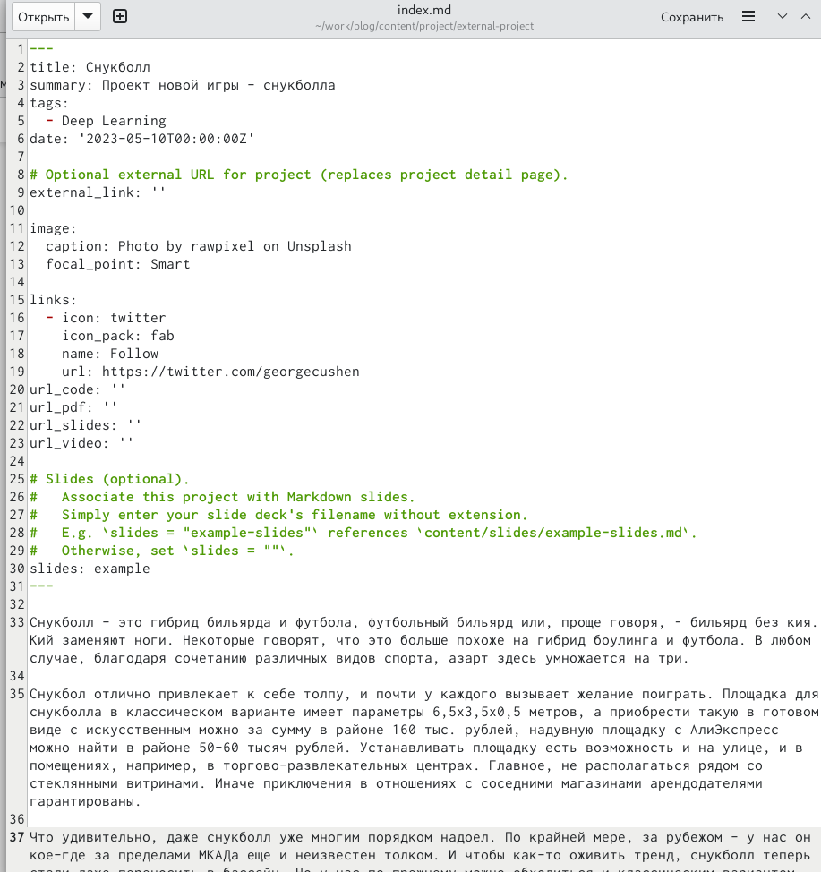
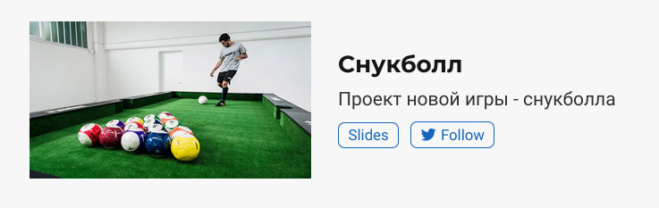
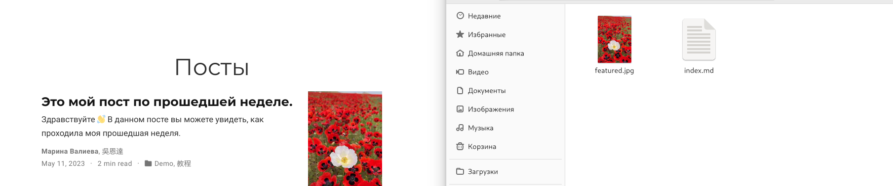
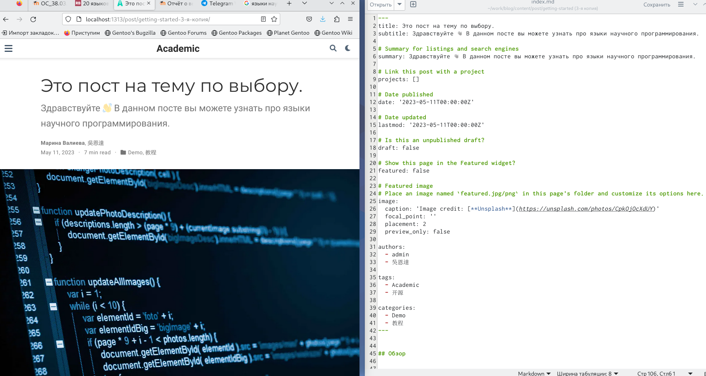

---
## Front matter
lang: ru-RU
title: Индивидуальный проект.
subtitle: Выполнение 5 этапа.
author:
  - Валиева М. Р.
institute:
  - Российский университет дружбы народов, Москва, Россия

## i18n babel
babel-lang: russian
babel-otherlangs: english

## Formatting pdf
toc: false
toc-title: Содержание
slide_level: 2
aspectratio: 169
section-titles: true
theme: metropolis
header-includes:
 - \metroset{progressbar=frametitle,sectionpage=progressbar,numbering=fraction}
 - '\makeatletter'
 - '\beamer@ignorenonframefalse'
 - '\makeatother'
---

# Информация

## Докладчик

  * Валиева Марина Русланбековна
  * Российский университет дружбы народов

# Вводная часть

## Цели и задачи

Добавить с сайту все остальные элементы.

# Создание презентации

# Результаты

## Содержание исследования

1. Сделала записи для персональных проектов.

##

{#fig:001 width=90%}

##

{#fig:002 width=90%}

##

{#fig:003 width=90%}

##

{#fig:004 width=90%}

##

{#fig:005 width=90%}

##

{#fig:006 width=90%}

##

{#fig:007 width=90%}

##

2. Сделала пост по прошедшей неедле.

{#fig:008 width=90%}

##

3. Добавила пост на тему "Языки научного программирования"

{#fig:009 width=90%}

## Результаты

Добавила на сайт все остальные элементы.

## Итоговый слайд

Спасибо за внимание!
